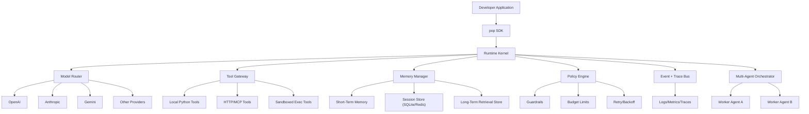
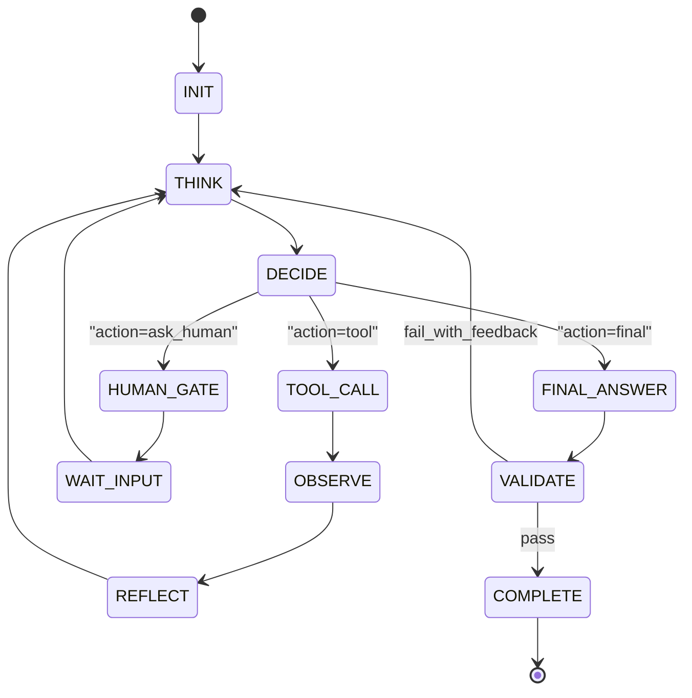
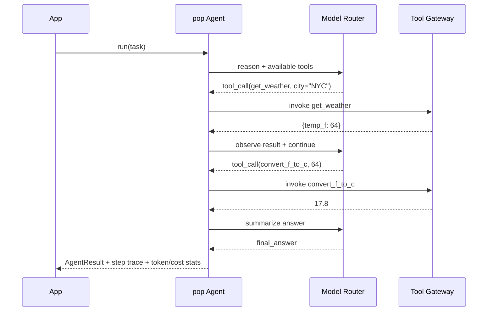
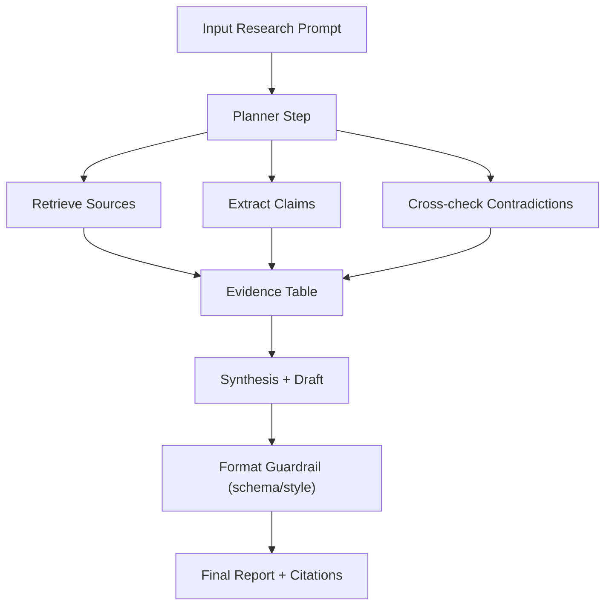
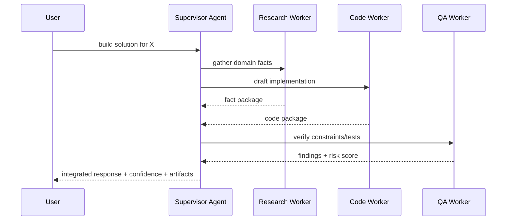
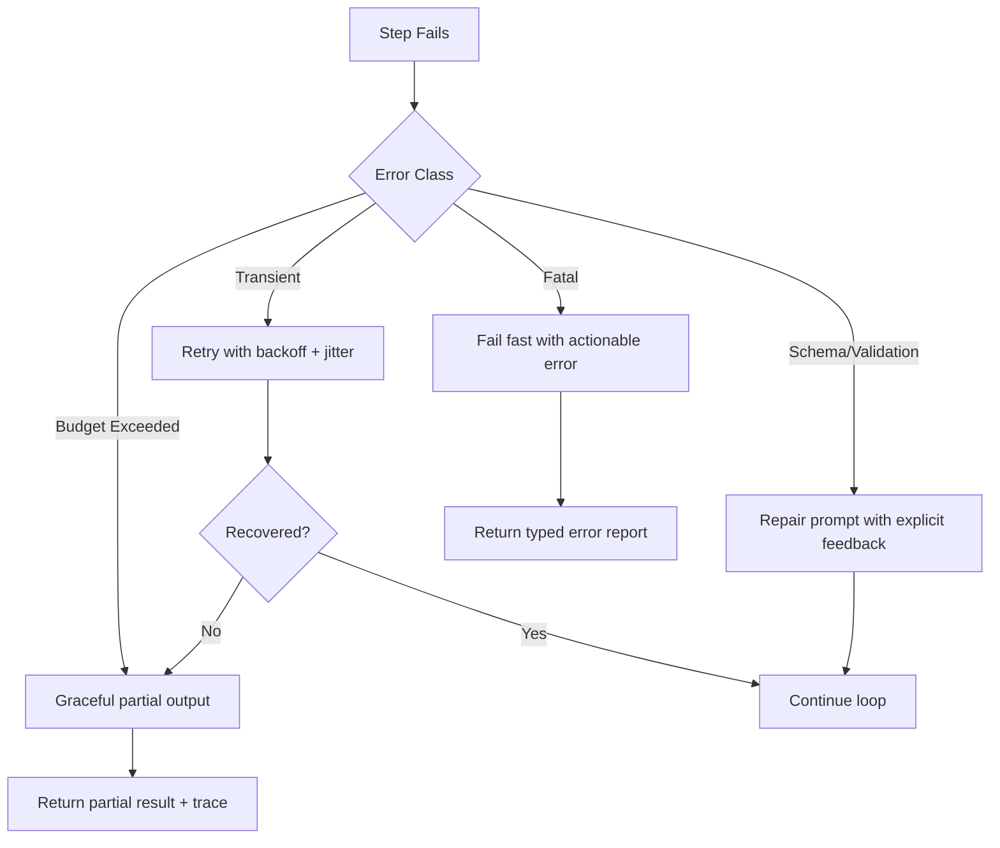
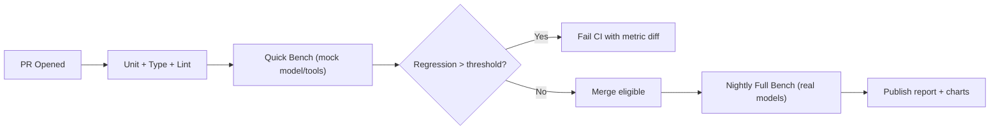
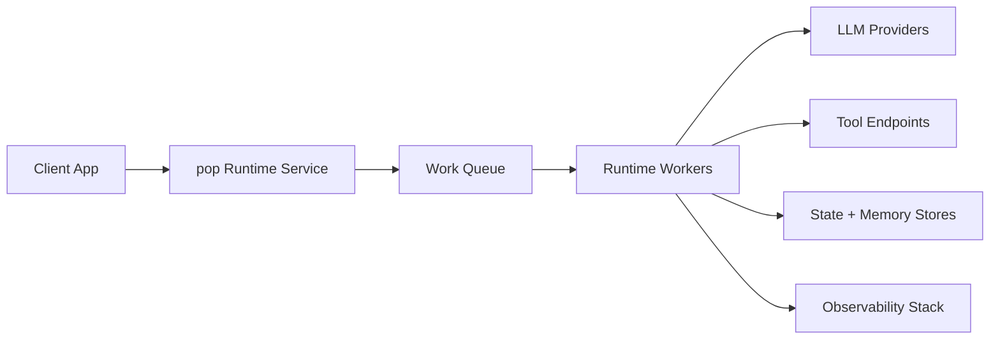

# pop Framework Architecture (Eval-Driven, Holistic v2)

This architecture is an iteration grounded in the latest evaluation plan in `/Users/chesli/Developer/temp_agent/EVAL_STRATEGY.md`.

## 1. Architecture Goal

Build `pop` as a lightweight but production-grade agent framework that is:

- Comparable on task accuracy to mainstream frameworks
- Strongly better on cost, latency, and developer experience
- Reliable under real-world faults
- Verifiable through open, reproducible evals

## 2. Quality Attributes and SLOs (Derived from Eval Plan)

| Eval Dimension | pop SLO / Target | Architectural Mechanism |
|---|---|---|
| Task accuracy | At least parity with major frameworks | Structured tool schema, explicit planning loop, deterministic retries |
| Cost efficiency | 20-30% fewer tokens/cost per success | Prompt budget controls, minimal hidden prompts, bounded retry policy |
| Latency | <5ms framework overhead per step, low import/init overhead | Thin runtime kernel, async-first internals, no heavy graph runtime |
| Reliability | >80% failure recovery, low run variance | Fault taxonomy, policy-driven recovery, checkpoint + replay |
| DX | Fewer concepts, fewer LOC, actionable errors | Small API surface, typed interfaces, direct stack traces |
| Tool-calling accuracy | Strong tool/arg selection quality | Rich `@tool` metadata, schema validation, feedback loop |
| Multi-agent efficiency | Sub-linear degradation with agent count | Supervisor pattern, bounded messaging, explicit backpressure |
| Resource footprint | Small dependency and memory footprint | Modular adapters, optional extras, lightweight defaults |

## 3. System Context



## 4. Logical Components

### 4.1 Runtime Kernel

Owns the agent loop: `think -> decide -> act -> observe -> reflect -> complete`.

Responsibilities:
- Maintain canonical run state
- Enforce step budgets and token budgets
- Delegate model calls and tool execution
- Emit deterministic events for replay

### 4.2 Model Router

Provider-agnostic layer with normalized request/response contract.

Responsibilities:
- Parse model URI (for example `openai:gpt-5-mini`)
- Normalize tool-call payloads across providers
- Optional fallback chain on provider-level failures

### 4.3 Tool Gateway

Single entry for sync/async tools, local tools, and remote tools.

Responsibilities:
- Register tools from function signatures + docstrings
- Validate arguments against JSON Schema
- Enforce tool-specific timeout/retry policies
- Record tool call cost/latency for eval metrics

### 4.4 Memory Manager

Layered memory model for accuracy and cost control.

Responsibilities:
- Maintain short-term conversational context
- Compress or summarize stale context windows
- Persist checkpoints for recovery and replay
- Optional long-term retrieval interface

### 4.5 Policy Engine

Centralizes runtime governance.

Responsibilities:
- Max steps, max cost, max latency budgets
- Safety/format guardrails
- Retry matrix by error class
- Human-in-the-loop gate decisions

### 4.6 Multi-Agent Orchestrator

Executes coordinator-worker patterns without forcing graph complexity for simple flows.

Responsibilities:
- Task decomposition and assignment
- Message routing and shared context control
- Deadlock/timeout detection and cancellation

### 4.7 Eval Harness (First-Class)

Shipped with framework lifecycle, not as an afterthought.

Responsibilities:
- Run common tasks across adapters
- Track all 8 evaluation dimensions
- Produce reproducible benchmark reports
- Gate CI on regression thresholds

## 5. Core Runtime State Model



Canonical per-step record:

```text
StepRecord {
  step_id,
  timestamp,
  thought_summary,
  selected_action,
  tool_name?,
  tool_args?,
  tool_result?,
  model_usage {input_tokens, output_tokens, cost_usd},
  latency_ms,
  error?,
  recovery_action?
}
```

This schema is the bridge between runtime behavior and eval metrics.

## 6. Scenario Flows (Major Use Cases)

## 6.1 Scenario A: Single-Agent Tool-Augmented Question

Use case: "Find latest weather in NYC and convert to C."



Technical details:
- Tool selection quality is improved by generated schema from typed tool signatures.
- Runtime enforces idempotent retry for transient tool errors.
- `AgentResult` includes eval-ready metadata without extra instrumentation code.

## 6.2 Scenario B: Multi-Step Research and Report Generation

Use case: gather sources, compare findings, write structured report.



Technical details:
- Planner output is constrained by a typed plan schema to reduce drift.
- Evidence table is persisted as structured state, not hidden in prompt text.
- Synthesis stage has an optional critic/reflection pass for quality and consistency.

## 6.3 Scenario C: Multi-Agent Orchestration

Use case: orchestrator delegates to domain workers (research, coding, reviewer).



Technical details:
- Shared context is partitioned: global brief + worker-local memory.
- Messaging budget prevents coordination chatter from exploding cost.
- Supervisor applies conflict-resolution policy when workers disagree.

## 6.4 Scenario D: Fault Injection and Recovery

Use case: provider timeout, tool 500, malformed tool args.



Technical details:
- Error taxonomy is explicit (`transient`, `validation`, `budget`, `fatal`).
- Recovery policy is deterministic and configurable per tool/provider.
- Partial-result strategy ensures graceful degradation and user trust.

## 6.5 Scenario E: Eval-Driven CI/CD Loop

Use case: each PR is blocked on benchmark regression budget.



Technical details:
- Quick bench isolates framework overhead from model/tool latency.
- Nightly/full bench computes all 8 dimensions on representative workloads.
- Result artifacts are versioned for trend analysis.

## 7. Deployment View

### 7.1 Local Library Mode (Default)

- Developer imports `pop` directly in Python app.
- Best for low-friction DX and script-style workloads.

### 7.2 Service Mode (Optional)

- Thin API wrapper around runtime for multi-tenant deployment.
- Shared policy and observability at service boundary.



## 8. Cross-Cutting Engineering Policies

| Concern | Policy |
|---|---|
| Concurrency | Async-first runtime; sync facade for ergonomics |
| Determinism | Seeded behavior where possible + full step event logging |
| Cost control | Hard budget caps and per-step token accounting |
| Security | Tool allowlist, secret isolation, safe execution boundaries |
| Observability | OpenTelemetry-compatible events + structured logs |
| Compatibility | Provider adapter contract with strict version tests |
| Extensibility | Plugin points for models, memory, hooks, scorers |

## 9. Rationale and Tradeoffs

### 9.1 Why this architecture

- It maps directly to measurable eval outcomes instead of abstract elegance.
- It keeps simple use cases simple (single loop), while enabling complex flows via composition.
- It avoids hidden runtime complexity that inflates latency and debugging cost.

### 9.2 Alternatives considered

| Alternative | Pros | Why not chosen as default |
|---|---|---|
| Graph-first runtime for all cases | Strong explicit DAG control | Overhead and DX burden for common single-agent tasks |
| Monolithic provider-specific core | Fast for one provider | Vendor lock-in and poor ecosystem fit |
| Fully implicit auto-retry/autoplan | Convenience | Hard to debug, unpredictable cost behavior |
| No built-in eval harness | Faster initial build | Cannot prove performance claims credibly |

### 9.3 Comparison: pop vs Heavy Agent Framework Style

| Dimension | pop | Heavy/abstraction-first framework |
|---|---|---|
| Core mental model | Small loop + typed tools | Many abstractions and protocols |
| Debugging | Shallow stack traces | Deep framework call stacks |
| Overhead | Low by design | Often higher due to orchestration layers |
| Learning curve | Lower concept count | Higher initial cognitive load |
| Bench credibility | Built-in eval gating | Often external or ad-hoc |

### 9.4 Comparison: pop Architecture vs Bespoke Software Engineer Build

Baseline: an experienced software engineer hand-builds an agent orchestrator with direct SDK calls.

| Dimension | pop architecture | Bespoke engineer implementation |
|---|---|---|
| Time to first production flow | Faster due to ready primitives | Slower initial build |
| Control and customization | High via plugins/policies | Maximum control |
| Consistency across projects | High, standardized | Varies by engineer/team |
| Eval instrumentation | Native and comparable | Usually retrofitted later |
| Long-term maintenance | Shared framework evolution | Team must maintain all internals |
| Risk of hidden coupling | Lower with contracts | Can grow ad-hoc without guardrails |

Interpretation:
- `pop` keeps enough flexibility for senior engineers while eliminating repetitive infrastructure work.
- Bespoke systems can be optimal for narrow, static workloads, but are usually weaker in reproducibility, shared tooling, and benchmark transparency.

## 10. Incremental Implementation Plan

1. `v0.1`: runtime kernel + tools + model router + quick eval harness (20 tasks)
2. `v0.2`: memory/checkpoints + reliability policy engine + full eval task set (100 tasks)
3. `v0.3`: multi-agent orchestrator + DX benchmark suite + public report generation
4. `v0.4`: service mode + advanced guardrails + monthly benchmark automation

## 11. What to Review Next

- Validate target SLO thresholds against real first benchmark runs.
- Confirm default policy matrix for retries and budget cutoffs.
- Prioritize the first 10 reference tasks to harden developer experience claims.

