# pop — Framework Architecture (Comprehensive Design Document)

> *"pop is to LangChain what uv is to Anaconda, or Flask to Django — fast, lean, straightforward, and super easy to start with."*

This document is the authoritative technical design for the pop agent framework. It is written for software engineers who want to understand not just **what** the framework does, but **why** every design decision was made. Every architectural choice is grounded in measurable eval criteria (see `EVAL_STRATEGY.md`) and explicit critique of existing frameworks (see `langchain_langraph_criticism_report.md`).

---

## Table of Contents

1. [Design Philosophy & Rationale](#1-design-philosophy--rationale)
2. [Problems We Solve (with Evidence)](#2-problems-we-solve)
3. [Architecture Overview](#3-architecture-overview)
4. [Core Abstractions (Only 5)](#4-core-abstractions)
5. [Detailed Component Design](#5-detailed-component-design)
   - 5.1 Agent — The Core Loop
   - 5.2 Tool System
   - 5.3 Model Router (Multi-Provider LLM Layer)
   - 5.4 Memory Architecture (Markdown-Based, No DB)
   - 5.5 Runner (Execution Engine)
   - 5.6 State Management
   - 5.7 Error Handling & Recovery
   - 5.8 Hook System (Opt-In Middleware)
6. [Multi-Agent Orchestration](#6-multi-agent-orchestration)
7. [Workflow Patterns (Simple → Complex)](#7-workflow-patterns)
8. [Scenario Walkthroughs (End-to-End)](#8-scenario-walkthroughs)
   - 8.1 Single-Agent Tool-Augmented Question
   - 8.2 Multi-Step Research and Report Generation
   - 8.3 Customer Support with Agent Handoff
   - 8.4 Coding Agent with Self-Correction
   - 8.5 Fault Injection and Recovery
   - 8.6 Eval-Driven CI/CD Loop
   - 8.7 Streaming with Real-Time Events
   - 8.8 Human-in-the-Loop Confirmation Flow
   - 8.9 Multi-Agent Debate / Verification
   - 8.10 Long-Running Agent with Checkpoint & Resume
9. [Deployment Views](#9-deployment-views)
10. [Comparison: pop vs LangChain (Detailed)](#10-comparison-pop-vs-langchain)
11. [Cross-Cutting Engineering Policies](#11-cross-cutting-engineering-policies)
12. [Rationale & Tradeoffs](#12-rationale--tradeoffs)
13. [Implementation Roadmap](#13-implementation-roadmap)

---

## 1. Design Philosophy & Rationale

### Core Tenets

| Principle | What It Means | Why It Matters | LangChain Contrast |
|-----------|---------------|----------------|-------------------|
| **Functions, not classes** | Tools are decorated functions. Agents are loops. Chains are pipelines. | Reduces cognitive load and boilerplate. Python developers already know functions. | LangChain's `BaseTool` is 1,586 lines. `Runnable` has 254 methods. You must learn `Runnable`, LCEL, callbacks, tracers, and serialization before you can be productive. |
| **5-minute onboarding** | From `pip install` to a working agent in under 5 minutes. | Developer adoption is directly correlated with time-to-hello-world. FastAPI wins because you get Swagger in 60 seconds. | LangChain requires understanding `StateGraph`, `TypedDict` with `Annotated` reducers, `ChannelWrite`, and compilation before running a basic agent. |
| **Zero magic** | Stack traces point to YOUR code, not 6,000 lines of framework internals. | When something breaks at 3 AM in production, you need to find the bug in minutes, not hours. | A simple LLM call in LangChain traverses 9,515 lines across 5 files. Debugging means navigating `RunnableSequence → RunnableParallel → ChannelWrite → Pregel`. |
| **Pay-for-what-you-use** | No mandatory tracing, no forced commercial dependencies. Observability is opt-in via hooks. | Keeps the core lean. Respects users who don't need (or want to pay for) commercial observability. | `langsmith` is a **mandatory** dependency of `langchain-core`. You cannot install LangChain without also installing a client for their commercial service plus its 9 transitive deps. |
| **Single package** | One `pip install pop-framework`. No version-matrix nightmares across 21 sub-packages. | Eliminates the "which versions are compatible?" problem that plagues LangChain users daily. | LangChain ecosystem has 21+ packages with interlocking version constraints. Upgrading one package frequently breaks others. |
| **Provider-agnostic** | OpenAI, Anthropic, Gemini, DeepSeek, Kimi, MiniMax, GLM — all first-class citizens. | Developers shouldn't be locked into one LLM provider. Switching should be a one-string change. | LangChain requires separate packages per provider (`langchain-openai`, `langchain-anthropic`, etc.) each with their own version constraints. |

### The Anti-Patterns We Reject

These anti-patterns are drawn directly from our [LangChain/LangGraph analysis](./langchain_langraph_criticism_report.md) with real source code evidence:

| Anti-Pattern | Evidence | pop's Approach |
|-------------|----------|----------------|
| 187,945 lines of code across 1,649 files | Counted from `langchain-core` + `langchain-classic` + `langgraph` + checkpoints + SDK + prebuilt | Target: <5,000 lines in core. An engineer can read the whole framework in one sitting. |
| 254 methods on the `Runnable` base class | `runnables/base.py` is 6,261 lines with 14 classes | Target: ~10 public API functions total. |
| 9,515 lines traversed for a single LLM call | `base.py` (6,261) + `serializable.py` (388) + `language_models/base.py` (391) + `chat_models.py` (1,834) + `config.py` (641) | Direct provider call through a thin adapter. <200 lines traversed. |
| `langsmith` as mandatory commercial dependency | `langsmith` is listed in `langchain-core`'s `[project.dependencies]` — not optional | Zero commercial dependencies. Tracing via opt-in hook. |
| 21 sub-packages with version matrix | 21 `pyproject.toml` files in the LangChain monorepo | Single package with optional extras: `pip install pop-framework[openai]`. |
| Graph abstraction for simple loops | `Pregel` engine is 3,669 lines with 57 imports for what is conceptually a while-loop | Loops by default. Graphs only if you really need them (and you probably don't). |
| 319 classes in langchain-core alone | 319 classes, 64 abstract methods, 116 properties | 5 concepts, ~15 classes total in the whole framework. |

**Rationale:** These aren't theoretical concerns. Every item above comes from analyzing LangChain's actual source code and from hundreds of developer complaints documented on Hacker News, GitHub issues, and Reddit. The dominant community sentiment is: "LangChain is great for learning/prototyping, but I rewrite everything myself for production." pop aims to be the thing you **keep** in production.

---

## 2. Problems We Solve

### Problem → Solution Matrix

Each problem is sourced from real developer pain points (HN comments, GitHub issues, community sentiment):

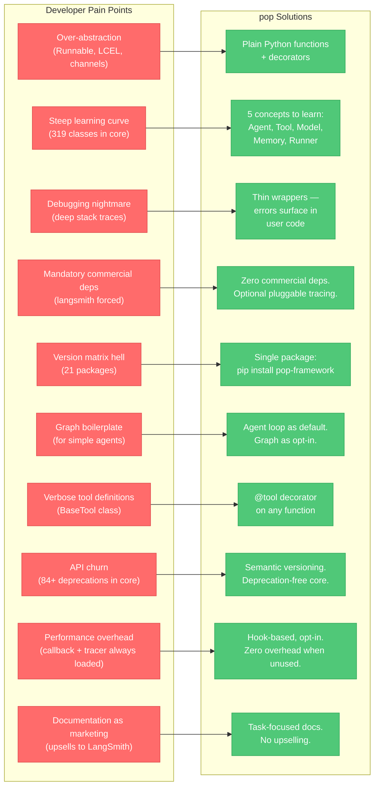
```mermaid
graph LR
    subgraph "Developer Pain Points"
        P1["Over-abstraction<br/>(Runnable, LCEL, channels)"]
        P2["Steep learning curve<br/>(319 classes in core)"]
        P3["Debugging nightmare<br/>(deep stack traces)"]
        P4["Mandatory commercial deps<br/>(langsmith forced)"]
        P5["Version matrix hell<br/>(21 packages)"]
        P6["Graph boilerplate<br/>(for simple agents)"]
        P7["Verbose tool definitions<br/>(BaseTool class)"]
        P8["API churn<br/>(84+ deprecations in core)"]
        P9["Performance overhead<br/>(callback + tracer always loaded)"]
        P10["Documentation as marketing<br/>(upsells to LangSmith)"]
    end

    subgraph "pop Solutions"
        S1["Plain Python functions<br/>+ decorators"]
        S2["5 concepts to learn:<br/>Agent, Tool, Model,<br/>Memory, Runner"]
        S3["Thin wrappers —<br/>errors surface in<br/>user code"]
        S4["Zero commercial deps.<br/>Optional pluggable tracing."]
        S5["Single package:<br/>pip install pop-framework"]
        S6["Agent loop as default.<br/>Graph as opt-in."]
        S7["@tool decorator<br/>on any function"]
        S8["Semantic versioning.<br/>Deprecation-free core."]
        S9["Hook-based, opt-in.<br/>Zero overhead when unused."]
        S10["Task-focused docs.<br/>No upselling."]
    end

    P1 --> S1
    P2 --> S2
    P3 --> S3
    P4 --> S4
    P5 --> S5
    P6 --> S6
    P7 --> S7
    P8 --> S8
    P9 --> S9
    P10 --> S10

    style P1 fill:#FF6B6B,stroke:#DF4B4B,color:#fff
    style P2 fill:#FF6B6B,stroke:#DF4B4B,color:#fff
    style P3 fill:#FF6B6B,stroke:#DF4B4B,color:#fff
    style P4 fill:#FF6B6B,stroke:#DF4B4B,color:#fff
    style P5 fill:#FF6B6B,stroke:#DF4B4B,color:#fff
    style P6 fill:#FF6B6B,stroke:#DF4B4B,color:#fff
    style P7 fill:#FF6B6B,stroke:#DF4B4B,color:#fff
    style P8 fill:#FF6B6B,stroke:#DF4B4B,color:#fff
    style P9 fill:#FF6B6B,stroke:#DF4B4B,color:#fff
    style P10 fill:#FF6B6B,stroke:#DF4B4B,color:#fff
    style S1 fill:#50C878,stroke:#30A858,color:#fff
    style S2 fill:#50C878,stroke:#30A858,color:#fff
    style S3 fill:#50C878,stroke:#30A858,color:#fff
    style S4 fill:#50C878,stroke:#30A858,color:#fff
    style S5 fill:#50C878,stroke:#30A858,color:#fff
    style S6 fill:#50C878,stroke:#30A858,color:#fff
    style S7 fill:#50C878,stroke:#30A858,color:#fff
    style S8 fill:#50C878,stroke:#30A858,color:#fff
    style S9 fill:#50C878,stroke:#30A858,color:#fff
    style S10 fill:#50C878,stroke:#30A858,color:#fff
```

### Quantified Evidence

| Pain Point | LangChain Reality | Source |
|-----------|------------------|--------|
| "Wrapping 2 lines in 2,000 lines" | `Runnable` base class: 6,261 lines, 254 methods, 14 classes in ONE file | Source code analysis of `runnables/base.py` |
| Callback system overhead | `callbacks/manager.py`: 2,697 lines. Fires on every invocation even with zero callbacks registered | Source code analysis |
| Tracer always loaded | 5,057 lines across 10+ files, always imported | Source code analysis |
| Import bloat | Importing `langchain-core` pulls in `pydantic`, `jsonpatch`, `langsmith`, `packaging`, `pyyaml`, `tenacity`, `typing-extensions`, `uuid-utils`. `langsmith` further pulls `httpx`, `orjson`, `requests`, `requests-toolbelt`, `zstandard`, `xxhash` | PyPI dependency analysis |
| Community sentiment | "Perf was horrible and it spent my entire OpenAI API quota in an hour or so. Decided to reimplement." (HN, 268+ upvotes on the original critique) | Hacker News threads |
| GitHub issues | 141 open bugs including broken tool calls, ignored system prompts, KeyErrors in middleware | GitHub issue tracker |

---

## 3. Architecture Overview

### High-Level System Diagram

This is the complete system map. Every box is a component you can understand, replace, or extend independently.

```
┌─────────────────────────────────────────────────────────────────────┐
│                        USER APPLICATION                              │
│   from pop import Agent, tool                                        │
│                                                                      │
│   @tool                                                              │
│   def search(query: str) -> str: ...                                 │
│                                                                      │
│   agent = Agent(model="openai:gpt-4o", tools=[search])              │
│   result = agent.run("Find the latest AI news")                      │
├──────────────────────────────────────────────────────────────────────┤
│                                                                      │
│  ┌──────────┐  ┌──────────┐  ┌──────────┐  ┌──────────────┐        │
│  │  Agent    │  │  Tool    │  │  Model   │  │   Memory     │        │
│  │  (loop)   │  │ (@tool)  │  │ (router) │  │  (markdown)  │        │
│  └────┬─────┘  └────┬─────┘  └────┬─────┘  └──────┬───────┘        │
│       │              │             │                │                 │
│  ┌────┴──────────────┴─────────────┴────────────────┴───────┐       │
│  │                     Runner (execution engine)             │       │
│  │         sync / async / streaming / parallel               │       │
│  └──────────────────────────┬────────────────────────────────┘       │
│                             │                                        │
│  ┌──────────────────────────┴────────────────────────────────┐       │
│  │              Model Router (provider-agnostic)             │       │
│  │  ┌────────┐ ┌──────────┐ ┌────────┐ ┌────────┐           │       │
│  │  │OpenAI  │ │Anthropic │ │Gemini  │ │DeepSeek│ ...       │       │
│  │  └────────┘ └──────────┘ └────────┘ └────────┘           │       │
│  └───────────────────────────────────────────────────────────┘       │
│                                                                      │
│  ┌───────────────────────────────────────────────────────────┐       │
│  │               Hooks (opt-in, pluggable)                   │       │
│  │  ┌─────────┐ ┌───────────┐ ┌────────────┐ ┌───────────┐ │       │
│  │  │ Tracing │ │ Guardrails│ │ Cost Track │ │ Custom    │ │       │
│  │  └─────────┘ └───────────┘ └────────────┘ └───────────┘ │       │
│  └───────────────────────────────────────────────────────────┘       │
└──────────────────────────────────────────────────────────────────────┘
```

### Component Relationship Diagram

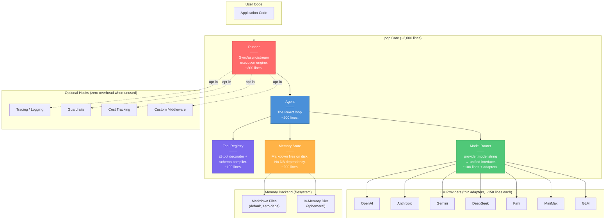
```mermaid
graph TB
    subgraph "User Code"
        UC[Application Code]
    end

    subgraph "pop Core (~3,000 lines)"
        direction TB
        A["Agent<br/>───<br/>The ReAct loop.<br/>~200 lines."]
        T["Tool Registry<br/>───<br/>@tool decorator +<br/>schema compiler.<br/>~100 lines."]
        M["Model Router<br/>───<br/>provider:model string<br/>→ unified interface.<br/>~100 lines + adapters."]
        MEM["Memory Store<br/>───<br/>Markdown files on disk.<br/>No DB dependency.<br/>~200 lines."]
        R["Runner<br/>───<br/>Sync/async/stream<br/>execution engine.<br/>~300 lines."]

        A --> T
        A --> M
        A --> MEM
        R --> A
    end

    subgraph "LLM Providers (thin adapters, ~150 lines each)"
        direction LR
        P1[OpenAI]
        P2[Anthropic]
        P3[Gemini]
        P4[DeepSeek]
        P5[Kimi]
        P6[MiniMax]
        P7[GLM]
    end

    subgraph "Optional Hooks (zero overhead when unused)"
        direction LR
        H1[Tracing / Logging]
        H2[Guardrails]
        H3[Cost Tracking]
        H4[Custom Middleware]
    end

    subgraph "Memory Backend (filesystem)"
        direction LR
        MB1["Markdown Files<br/>(default, zero deps)"]
        MB2["In-Memory Dict<br/>(ephemeral)"]
    end

    UC --> R
    M --> P1 & P2 & P3 & P4 & P5 & P6 & P7
    R -.->|opt-in| H1 & H2 & H3 & H4
    MEM --> MB1 & MB2

    style A fill:#4A90D9,stroke:#2C5F8A,color:#fff
    style T fill:#7B68EE,stroke:#5B48CE,color:#fff
    style M fill:#50C878,stroke:#30A858,color:#fff
    style MEM fill:#FFB347,stroke:#DF9327,color:#fff
    style R fill:#FF6B6B,stroke:#DF4B4B,color:#fff
```

**Why this architecture?**

1. **Five components, clear responsibilities.** Each box does one thing. There is no `Runnable` protocol that every component must inherit from. No `Serializable` base class. No callback manager that fires on every invocation.

2. **Memory uses markdown files, not databases.** This is a deliberate choice. SQLite, Redis, and vector DBs add dependencies, complexity, and operational burden. For most agent use cases, a directory of markdown files with frontmatter metadata is sufficient — it's human-readable, git-friendly, grep-searchable, and requires zero additional infrastructure. If you need a database later, bring your own.

3. **Hooks are opt-in, not mandatory.** LangChain loads its callback system (2,697 lines) and tracer system (5,057 lines) on every invocation regardless of whether you use them. In pop, hooks are a simple protocol that costs nothing unless you register one.

---

## 4. Core Abstractions (Only 5)

### Concept Map

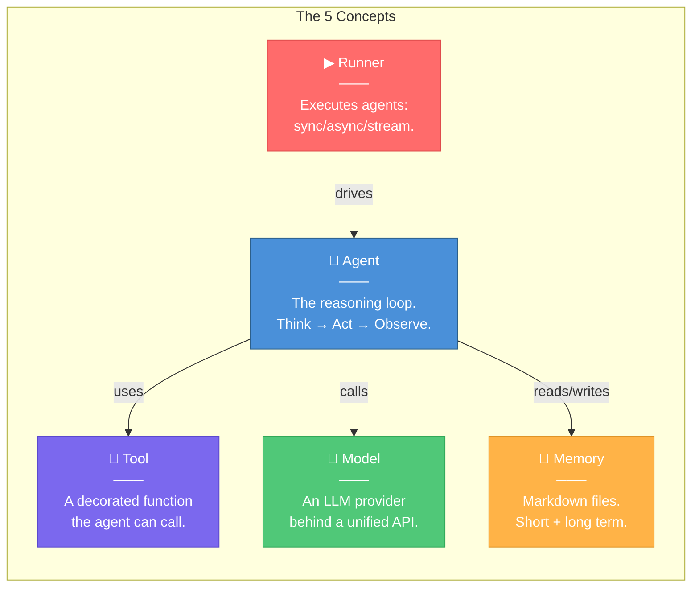
```mermaid
graph LR
    subgraph "The 5 Concepts"
        Agent["🔄 Agent<br/>───<br/>The reasoning loop.<br/>Think → Act → Observe."]
        Tool["🔧 Tool<br/>───<br/>A decorated function<br/>the agent can call."]
        Model["🤖 Model<br/>───<br/>An LLM provider<br/>behind a unified API."]
        Memory["📝 Memory<br/>───<br/>Markdown files.<br/>Short + long term."]
        Runner["▶ Runner<br/>───<br/>Executes agents:<br/>sync/async/stream."]
    end

    Agent -->|uses| Tool
    Agent -->|calls| Model
    Agent -->|reads/writes| Memory
    Runner -->|drives| Agent

    style Agent fill:#4A90D9,stroke:#2C5F8A,color:#fff
    style Tool fill:#7B68EE,stroke:#5B48CE,color:#fff
    style Model fill:#50C878,stroke:#30A858,color:#fff
    style Memory fill:#FFB347,stroke:#DF9327,color:#fff
    style Runner fill:#FF6B6B,stroke:#DF4B4B,color:#fff
```

### Detailed Concept Table

| # | Abstraction | What It Is | Lines Target | Rationale |
|---|-------------|------------|-------------|-----------|
| 1 | **Agent** | A loop: Reason → Act → Observe → Repeat (ReAct pattern with optional Reflexion) | ~200 lines | This is the core abstraction. Most "agent" behavior is a while-loop that calls an LLM, optionally calls a tool, and feeds the result back. LangGraph models this as a compiled graph with channels, nodes, edges, and a Pregel engine. We model it as a loop because that's what it is. |
| 2 | **Tool** | A decorated Python function with typed args. The `@tool` decorator extracts type hints + docstring → JSON Schema automatically. | ~100 lines | LangChain's `BaseTool` is 1,586 lines. Creating a tool requires defining a `BaseModel` for args, a class inheriting from `BaseTool`, and implementing `_run`. In pop, you decorate a function. That's it. |
| 3 | **Model** | A provider-agnostic LLM interface. You write `model="openai:gpt-4o"` and the router handles the rest. | ~100 lines (router) + ~150 lines per adapter | LangChain requires `pip install langchain-openai` for OpenAI, `pip install langchain-anthropic` for Anthropic, etc. Each is a separate package with separate version constraints. In pop, all providers ship in one package. Switching is one string change. |
| 4 | **Memory** | Markdown files on disk for persistent memory. In-memory dict for ephemeral. Multi-tier: core (always in context), conversation (sliding window), episodic (past experiences), semantic (knowledge). | ~200 lines | Most agent memory implementations pull in SQLite, Redis, or a vector DB. This adds dependencies and operational complexity. Markdown files are human-readable, git-friendly, grep-searchable, zero-dependency, and sufficient for the vast majority of use cases. See Section 5.4 for the full rationale. |
| 5 | **Runner** | Executes agents with sync, async, streaming, and parallel modes. Owns step budgets, cost tracking, and timeout enforcement. | ~300 lines | LangChain's execution path goes through `Runnable.invoke → RunnableSequence → RunnableParallel → ...`. In pop, the Runner is a simple executor that drives the Agent loop. |

**Total core: ~1,500-3,000 lines.** A developer can read and understand the entire framework in one sitting.

### Why Only 5?

**Rationale:** LangChain requires you to learn: `Runnable`, `RunnableSequence`, `RunnableParallel`, `RunnablePassthrough`, `RunnableLambda`, `RunnableBranch`, LCEL (`|` operator), `BaseTool`, `ToolMessage`, `BaseMessage`, `HumanMessage`, `AIMessage`, `SystemMessage`, `BaseRetriever`, `BaseDocumentLoader`, `TextSplitter`, `BaseMemory`, `ConversationBufferMemory`, `BaseCallbackHandler`, `CallbackManager`, `StateGraph`, `TypedDict` with `Annotated` reducers, `CompiledStateGraph`, `Pregel`, channel types (`LastValue`, `BinaryOperatorAggregate`, `EphemeralValue`, `Topic`, etc.), `Checkpoint`, and many more — 319 classes in `langchain-core` alone.

In pop, you learn 5 concepts. If you know Python functions, type hints, and decorators, you already know 80% of the API.

### The Learning Curve Comparison


```mermaid
graph TD
    subgraph "pop: What You Need to Learn"
        direction TB
        PA["Agent (a loop)"]
        PB["Tool (a decorated function)"]
        PC["Model (a string like 'openai:gpt-4o')"]
        PD["Memory (markdown files)"]
        PE["Runner (sync/async/stream)"]
    end

    subgraph "LangChain: What You Need to Learn"
        direction TB
        LA["Runnable protocol (254 methods)"]
        LB["LCEL (| operator chaining)"]
        LC["BaseTool (class-based tools)"]
        LD["Message types (Human, AI, System, Tool, Function)"]
        LE["Callback system (handlers, managers)"]
        LF["Tracer system"]
        LG["Serialization (every object is Serializable)"]
        LH["StateGraph (nodes, edges, state)"]
        LI["TypedDict + Annotated reducers"]
        LJ["Pregel execution engine"]
        LK["Channel types (9 types)"]
        LL["Checkpoint system"]
        LM["Config system (configurable fields)"]
    end

    style PA fill:#50C878,stroke:#30A858,color:#fff
    style PB fill:#50C878,stroke:#30A858,color:#fff
    style PC fill:#50C878,stroke:#30A858,color:#fff
    style PD fill:#50C878,stroke:#30A858,color:#fff
    style PE fill:#50C878,stroke:#30A858,color:#fff

    style LA fill:#FF6B6B,stroke:#DF4B4B,color:#fff
    style LB fill:#FF6B6B,stroke:#DF4B4B,color:#fff
    style LC fill:#FF6B6B,stroke:#DF4B4B,color:#fff
    style LD fill:#FF6B6B,stroke:#DF4B4B,color:#fff
    style LE fill:#FF6B6B,stroke:#DF4B4B,color:#fff
    style LF fill:#FF6B6B,stroke:#DF4B4B,color:#fff
    style LG fill:#FF6B6B,stroke:#DF4B4B,color:#fff
    style LH fill:#FF6B6B,stroke:#DF4B4B,color:#fff
    style LI fill:#FF6B6B,stroke:#DF4B4B,color:#fff
    style LJ fill:#FF6B6B,stroke:#DF4B4B,color:#fff
    style LK fill:#FF6B6B,stroke:#DF4B4B,color:#fff
    style LL fill:#FF6B6B,stroke:#DF4B4B,color:#fff
    style LM fill:#FF6B6B,stroke:#DF4B4B,color:#fff
```

---

## 5. Detailed Component Design

### 5.1 Agent — The Core Loop

#### What It Is

The Agent is a ReAct loop (Reason + Act) with optional Reflexion (self-correction). It is the heart of the framework.

**Rationale:** The ReAct pattern (Yao et al., 2022) is the foundational architecture for tool-using LLM agents. It alternates between reasoning ("I need to search for X") and acting (calling a tool). Reflexion (Shinn et al., 2023) adds self-correction: when the agent fails, it critiques its own approach and tries a different strategy. Together, these are the most effective patterns for general-purpose agents — and they're both fundamentally loops, not graphs.

#### State Machine Diagram

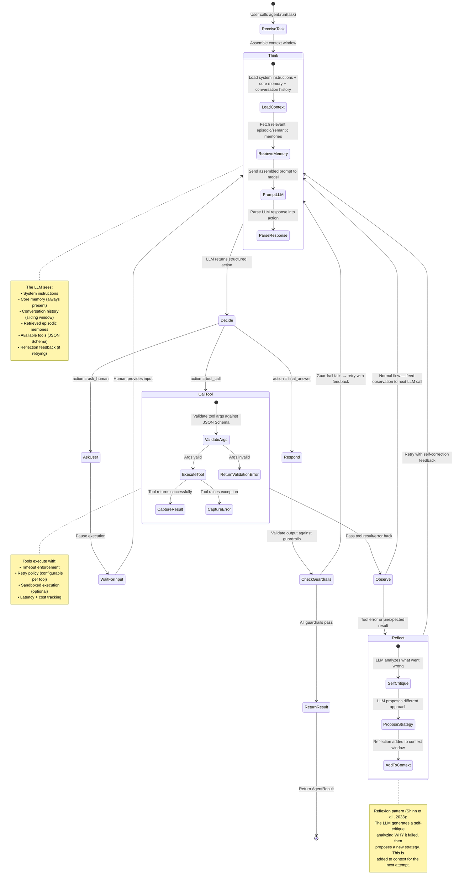
```mermaid
stateDiagram-v2
    [*] --> ReceiveTask: User calls agent.run(task)

    ReceiveTask --> Think: Assemble context window

    state Think {
        [*] --> LoadContext: Load system instructions + core memory + conversation history
        LoadContext --> RetrieveMemory: Fetch relevant episodic/semantic memories
        RetrieveMemory --> PromptLLM: Send assembled prompt to model
        PromptLLM --> ParseResponse: Parse LLM response into action
    }

    Think --> Decide: LLM returns structured action

    state Decide <<choice>>
    Decide --> CallTool: action = tool_call
    Decide --> Respond: action = final_answer
    Decide --> AskUser: action = ask_human

    state CallTool {
        [*] --> ValidateArgs: Validate tool args against JSON Schema
        ValidateArgs --> ExecuteTool: Args valid
        ValidateArgs --> ReturnValidationError: Args invalid
        ExecuteTool --> CaptureResult: Tool returns successfully
        ExecuteTool --> CaptureError: Tool raises exception
    }

    CallTool --> Observe: Pass tool result/error back

    state Observe <<choice>>
    Observe --> Think: Normal flow — feed observation to next LLM call
    Observe --> Reflect: Tool error or unexpected result

    state Reflect {
        [*] --> SelfCritique: LLM analyzes what went wrong
        SelfCritique --> ProposeStrategy: LLM proposes different approach
        ProposeStrategy --> AddToContext: Reflection added to context window
    }

    Reflect --> Think: Retry with self-correction feedback

    AskUser --> WaitForInput: Pause execution
    WaitForInput --> Think: Human provides input

    Respond --> CheckGuardrails: Validate output against guardrails

    state CheckGuardrails <<choice>>
    CheckGuardrails --> ReturnResult: All guardrails pass
    CheckGuardrails --> Think: Guardrail fails → retry with feedback

    ReturnResult --> [*]: Return AgentResult

    note right of Think
        The LLM sees:
        • System instructions
        • Core memory (always present)
        • Conversation history (sliding window)
        • Retrieved episodic memories
        • Available tools (JSON Schema)
        • Reflection feedback (if retrying)
    end note

    note right of CallTool
        Tools execute with:
        • Timeout enforcement
        • Retry policy (configurable per tool)
        • Sandboxed execution (optional)
        • Latency + cost tracking
    end note

    note right of Reflect
        Reflexion pattern (Shinn et al., 2023):
        The LLM generates a self-critique
        analyzing WHY it failed, then
        proposes a new strategy. This is
        added to context for the next attempt.
    end note
```

#### Why a Loop, Not a Graph

**Rationale:** LangGraph's core abstraction is a compiled state graph with nodes, edges, conditional routing, and a Pregel execution engine. This is a powerful general-purpose computation model — it can express any workflow. But power comes at a cost: the `Pregel` engine is 3,669 lines with 57 imports, and using it requires understanding `StateGraph`, `TypedDict` with `Annotated` reducers, 9 channel types, and a compilation step.

The insight is: **most agents are loops.** The agent calls the LLM. The LLM decides to call a tool or respond. If it called a tool, the result goes back to the LLM. Repeat until done. This is a while-loop with a match statement. Expressing it as a graph adds zero capability but substantial complexity.

For the ~10% of cases that genuinely need DAG-style orchestration (parallel execution, complex branching), pop provides composition functions (`pipeline`, `orchestrate`, `fan_out`) that are simpler than a full graph engine.

#### Execution Loop (Detailed Sequence)

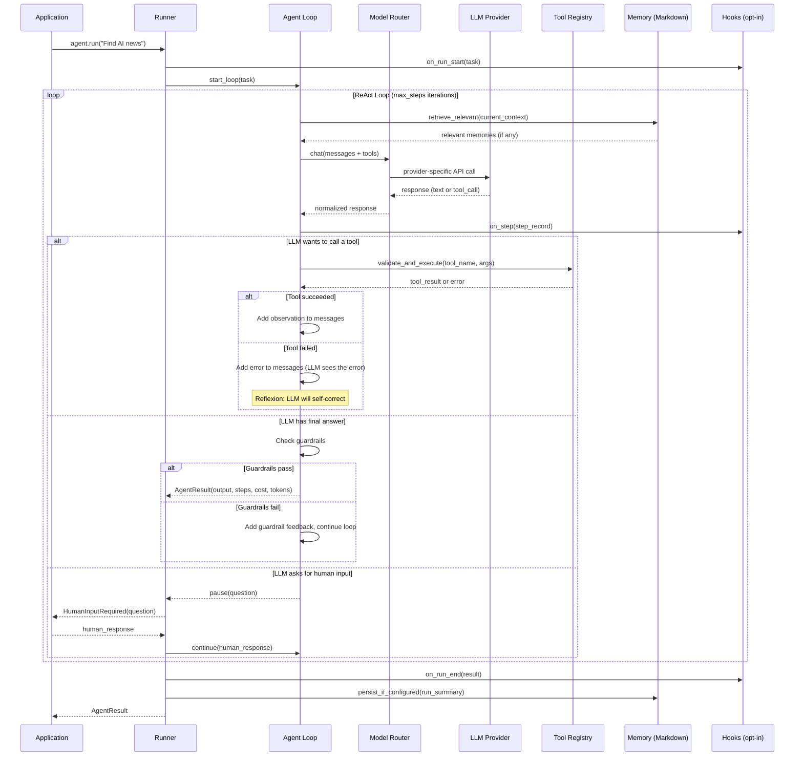
```mermaid
sequenceDiagram
    participant App as Application
    participant Runner as Runner
    participant Agent as Agent Loop
    participant Model as Model Router
    participant LLM as LLM Provider
    participant Tools as Tool Registry
    participant Memory as Memory (Markdown)
    participant Hooks as Hooks (opt-in)

    App->>Runner: agent.run("Find AI news")
    Runner->>Hooks: on_run_start(task)
    Runner->>Agent: start_loop(task)

    loop ReAct Loop (max_steps iterations)
        Agent->>Memory: retrieve_relevant(current_context)
        Memory-->>Agent: relevant memories (if any)

        Agent->>Model: chat(messages + tools)
        Model->>LLM: provider-specific API call
        LLM-->>Model: response (text or tool_call)
        Model-->>Agent: normalized response

        Agent->>Hooks: on_step(step_record)

        alt LLM wants to call a tool
            Agent->>Tools: validate_and_execute(tool_name, args)
            Tools-->>Agent: tool_result or error

            alt Tool succeeded
                Agent->>Agent: Add observation to messages
            else Tool failed
                Agent->>Agent: Add error to messages (LLM sees the error)
                Note over Agent: Reflexion: LLM will self-correct
            end

        else LLM has final answer
            Agent->>Agent: Check guardrails
            alt Guardrails pass
                Agent-->>Runner: AgentResult(output, steps, cost, tokens)
            else Guardrails fail
                Agent->>Agent: Add guardrail feedback, continue loop
            end

        else LLM asks for human input
            Agent-->>Runner: pause(question)
            Runner-->>App: HumanInputRequired(question)
            App-->>Runner: human_response
            Runner->>Agent: continue(human_response)
        end
    end

    Runner->>Hooks: on_run_end(result)
    Runner->>Memory: persist_if_configured(run_summary)
    Runner-->>App: AgentResult
```

#### API

```python
from pop import Agent, tool

# Define tools
@tool
def search(query: str) -> str:
    """Search the web for information."""
    return web_search(query)

@tool
def calculate(expression: str) -> float:
    """Evaluate a math expression."""
    return safe_eval(expression)

# Create agent (3 lines)
agent = Agent(
    model="openai:gpt-4o",       # provider:model format
    tools=[search, calculate],
    instructions="You are a helpful research assistant.",
)

# Run
result = agent.run("What is the population of Tokyo times 2?")
print(result.output)        # "The population of Tokyo is ~14M, so 14M × 2 = 28,000,000"
print(result.steps)         # [Step(thought=..., action=..., observation=...), ...]
print(result.token_usage)   # TokenUsage(input=1234, output=567, total=1801)
print(result.cost)          # 0.0023  (in USD)
```

---

### 5.2 Tool System

#### Architecture

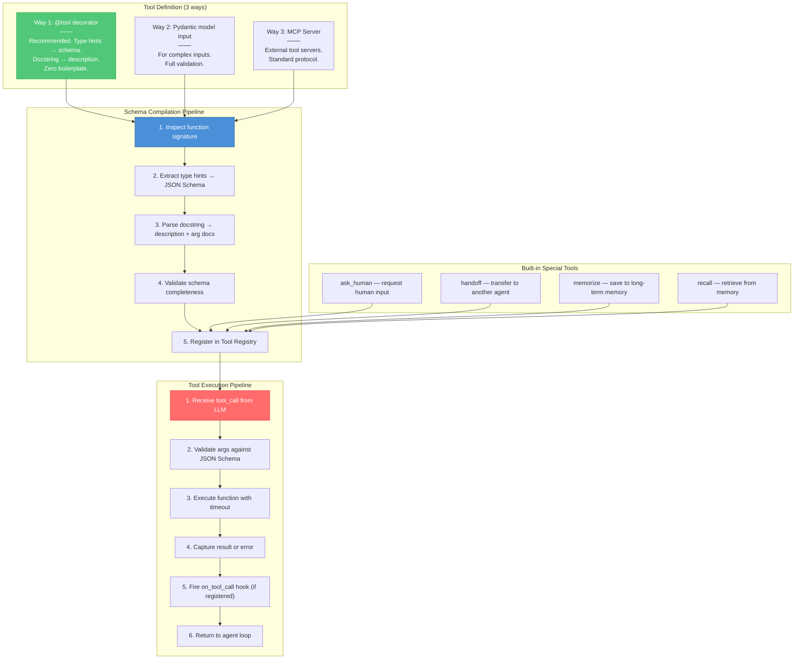
```mermaid
graph TB
    subgraph "Tool Definition (3 ways)"
        direction TB
        D1["Way 1: @tool decorator<br/>───<br/>Recommended. Type hints → schema.<br/>Docstring → description.<br/>Zero boilerplate."]
        D2["Way 2: Pydantic model input<br/>───<br/>For complex inputs.<br/>Full validation."]
        D3["Way 3: MCP Server<br/>───<br/>External tool servers.<br/>Standard protocol."]
    end

    subgraph "Schema Compilation Pipeline"
        direction TB
        SC1["1. Inspect function signature"]
        SC2["2. Extract type hints → JSON Schema"]
        SC3["3. Parse docstring → description + arg docs"]
        SC4["4. Validate schema completeness"]
        SC5["5. Register in Tool Registry"]
        SC1 --> SC2 --> SC3 --> SC4 --> SC5
    end

    subgraph "Tool Execution Pipeline"
        direction TB
        TE1["1. Receive tool_call from LLM"]
        TE2["2. Validate args against JSON Schema"]
        TE3["3. Execute function with timeout"]
        TE4["4. Capture result or error"]
        TE5["5. Fire on_tool_call hook (if registered)"]
        TE6["6. Return to agent loop"]
        TE1 --> TE2 --> TE3 --> TE4 --> TE5 --> TE6
    end

    subgraph "Built-in Special Tools"
        direction TB
        ST1["ask_human — request human input"]
        ST2["handoff — transfer to another agent"]
        ST3["memorize — save to long-term memory"]
        ST4["recall — retrieve from memory"]
    end

    D1 & D2 & D3 --> SC1
    SC5 --> TE1
    ST1 & ST2 & ST3 & ST4 --> SC5

    style D1 fill:#50C878,stroke:#30A858,color:#fff
    style SC1 fill:#4A90D9,stroke:#2C5F8A,color:#fff
    style TE1 fill:#FF6B6B,stroke:#DF4B4B,color:#fff
```

#### How Schema Compilation Works

**Rationale:** The quality of the JSON Schema that describes a tool directly affects the LLM's ability to select and use it correctly. LangChain requires manual schema definition via `BaseModel` + `BaseTool` class. Pop auto-generates the schema from Python type hints and docstrings, which means:

1. Schema is always in sync with the actual function signature (no drift)
2. Zero boilerplate for the developer
3. IDE autocompletion works naturally
4. The schema quality is as good as the developer's type hints + docstrings

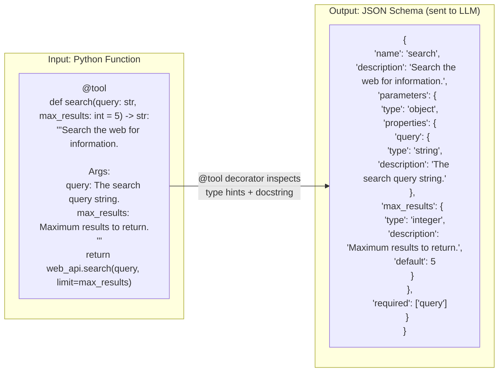
```mermaid
graph LR
    subgraph "Input: Python Function"
        F["@tool<br/>def search(query: str, max_results: int = 5) -> str:<br/>    '''Search the web for information.<br/><br/>    Args:<br/>        query: The search query string.<br/>        max_results: Maximum results to return.<br/>    '''<br/>    return web_api.search(query, limit=max_results)"]
    end

    subgraph "Output: JSON Schema (sent to LLM)"
        S["{<br/>  'name': 'search',<br/>  'description': 'Search the web for information.',<br/>  'parameters': {<br/>    'type': 'object',<br/>    'properties': {<br/>      'query': {<br/>        'type': 'string',<br/>        'description': 'The search query string.'<br/>      },<br/>      'max_results': {<br/>        'type': 'integer',<br/>        'description': 'Maximum results to return.',<br/>        'default': 5<br/>      }<br/>    },<br/>    'required': ['query']<br/>  }<br/>}"]
    end

    F -->|"@tool decorator inspects<br/>type hints + docstring"| S
```

#### Tool Definition Comparison: pop vs LangChain

```python
# ── LangChain: 15 lines to define a tool ──
from langchain_core.tools import BaseTool
from pydantic import BaseModel, Field

class SearchInput(BaseModel):
    query: str = Field(description="search query")
    max_results: int = Field(default=5, description="max results")

class SearchTool(BaseTool):
    name: str = "search"
    description: str = "Search the web for information"
    args_schema: type[BaseModel] = SearchInput

    def _run(self, query: str, max_results: int = 5) -> str:
        return web_api.search(query, limit=max_results)

# ── pop: 6 lines to define the same tool ──
from pop import tool

@tool
def search(query: str, max_results: int = 5) -> str:
    """Search the web for information.

    Args:
        query: search query
        max_results: max results
    """
    return web_api.search(query, limit=max_results)
```

**Why this matters for evals:** Tool-calling accuracy (Eval Dimension 6) depends heavily on schema quality. Better descriptions → better tool selection by the LLM → fewer wasted rounds → lower cost. Auto-generating schemas from type hints ensures consistency and reduces human error.

#### API (All Tool Definition Methods)

```python
from pop import tool, Agent
from pop.tools import mcp_tools
from pydantic import BaseModel

# Way 1: @tool decorator (recommended)
@tool
def search(query: str, max_results: int = 5) -> str:
    """Search the web for information.

    Args:
        query: The search query string.
        max_results: Maximum number of results to return.
    """
    return web_api.search(query, limit=max_results)

# Way 2: Pydantic model for complex inputs
class EmailParams(BaseModel):
    to: str
    subject: str
    body: str

@tool
def send_email(params: EmailParams) -> str:
    """Send an email to a recipient."""
    return email_service.send(**params.model_dump())

# Way 3: Context-aware tools (dependency injection)
@tool
def get_user_orders(ctx: Context) -> list[dict]:
    """Get the current user's recent orders."""
    return db.query_orders(user_id=ctx.user_id)

# Way 4: MCP server tools (external tools via standard protocol)
mcp = mcp_tools("npx -y @modelcontextprotocol/server-filesystem /tmp")
agent = Agent(model="openai:gpt-4o", tools=[search, *mcp])

# Way 5: Dynamic tool creation
def make_api_tool(endpoint: str, method: str = "GET"):
    @tool(name=f"api_{endpoint.replace('/', '_')}")
    def api_call(params: dict) -> dict:
        f"""Call the {endpoint} API endpoint."""
        return requests.request(method, f"{BASE}/{endpoint}", json=params).json()
    return api_call
```

---

### 5.3 Model Router (Multi-Provider LLM Layer)

#### Architecture

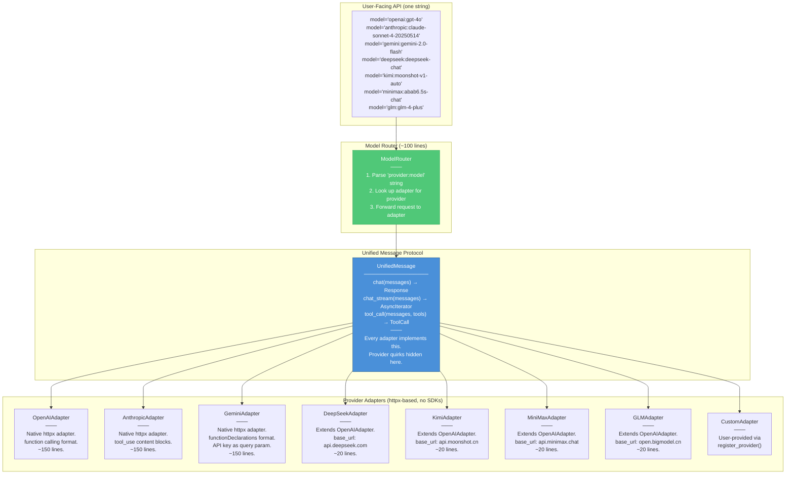
```mermaid
graph TB
    subgraph "User-Facing API (one string)"
        UA["model='openai:gpt-4o'<br/>model='anthropic:claude-sonnet-4-20250514'<br/>model='gemini:gemini-2.0-flash'<br/>model='deepseek:deepseek-chat'<br/>model='kimi:moonshot-v1-auto'<br/>model='minimax:abab6.5s-chat'<br/>model='glm:glm-4-plus'"]
    end

    subgraph "Model Router (~100 lines)"
        MR["ModelRouter<br/>───<br/>1. Parse 'provider:model' string<br/>2. Look up adapter for provider<br/>3. Forward request to adapter"]
    end

    subgraph "Unified Message Protocol"
        UI["UnifiedMessage<br/>─────────────────<br/>chat(messages) → Response<br/>chat_stream(messages) → AsyncIterator<br/>tool_call(messages, tools) → ToolCall<br/>───<br/>Every adapter implements this.<br/>Provider quirks hidden here."]
    end

    subgraph "Provider Adapters (httpx-based, no SDKs)"
        direction TB
        OA["OpenAIAdapter<br/>───<br/>Native httpx adapter.<br/>function calling format.<br/>~150 lines."]
        AN["AnthropicAdapter<br/>───<br/>Native httpx adapter.<br/>tool_use content blocks.<br/>~150 lines."]
        GE["GeminiAdapter<br/>───<br/>Native httpx adapter.<br/>functionDeclarations format.<br/>API key as query param.<br/>~150 lines."]
        DS["DeepSeekAdapter<br/>───<br/>Extends OpenAIAdapter.<br/>base_url: api.deepseek.com<br/>~20 lines."]
        KI["KimiAdapter<br/>───<br/>Extends OpenAIAdapter.<br/>base_url: api.moonshot.cn<br/>~20 lines."]
        MM["MiniMaxAdapter<br/>───<br/>Extends OpenAIAdapter.<br/>base_url: api.minimax.chat<br/>~20 lines."]
        GL["GLMAdapter<br/>───<br/>Extends OpenAIAdapter.<br/>base_url: open.bigmodel.cn<br/>~20 lines."]
        CU["CustomAdapter<br/>───<br/>User-provided via<br/>register_provider()"]
    end

    UA --> MR
    MR --> UI
    UI --> OA & AN & GE & DS & KI & MM & GL & CU

    style MR fill:#50C878,stroke:#30A858,color:#fff
    style UI fill:#4A90D9,stroke:#2C5F8A,color:#fff
```

#### Message Normalization Flow

**Rationale:** Each LLM provider has a different API format for messages, tool calls, and responses. OpenAI uses `function_call` / `tool_calls`, Anthropic uses `tool_use` content blocks, Gemini uses `function_declarations`. The Model Router normalizes all of these into a single `UnifiedMessage` format so the Agent doesn't need to know which provider it's talking to.

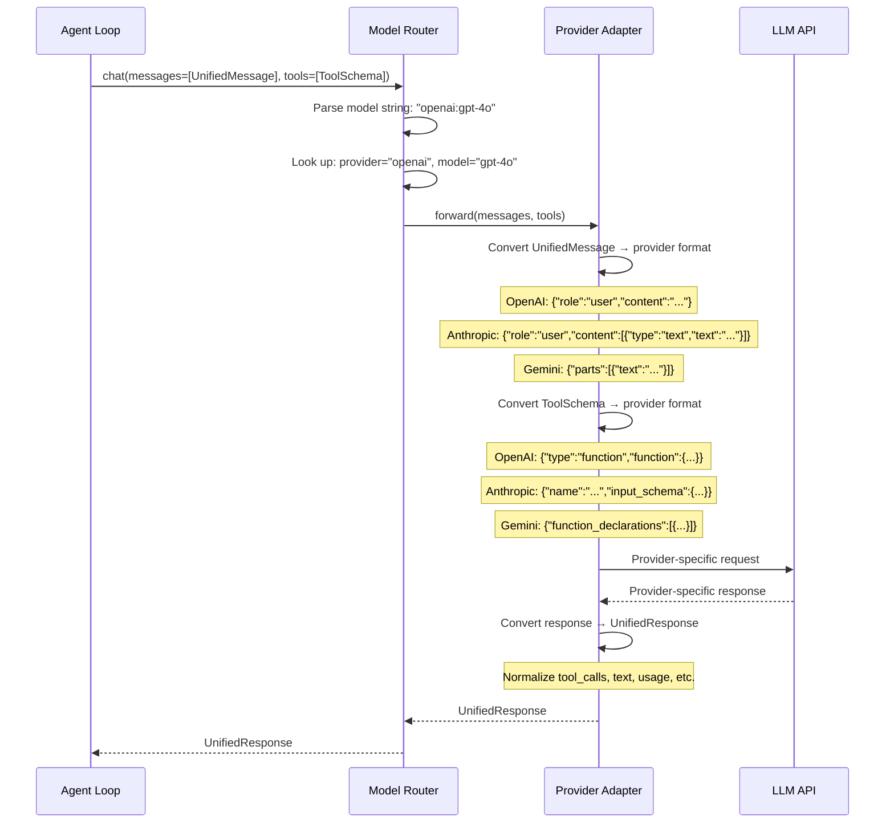
```mermaid
sequenceDiagram
    participant Agent as Agent Loop
    participant Router as Model Router
    participant Adapter as Provider Adapter
    participant API as LLM API

    Agent->>Router: chat(messages=[UnifiedMessage], tools=[ToolSchema])

    Router->>Router: Parse model string: "openai:gpt-4o"
    Router->>Router: Look up: provider="openai", model="gpt-4o"
    Router->>Adapter: forward(messages, tools)

    Adapter->>Adapter: Convert UnifiedMessage → provider format
    Note over Adapter: OpenAI: {"role":"user","content":"..."}
    Note over Adapter: Anthropic: {"role":"user","content":[{"type":"text","text":"..."}]}
    Note over Adapter: Gemini: {"parts":[{"text":"..."}]}

    Adapter->>Adapter: Convert ToolSchema → provider format
    Note over Adapter: OpenAI: {"type":"function","function":{...}}
    Note over Adapter: Anthropic: {"name":"...","input_schema":{...}}
    Note over Adapter: Gemini: {"function_declarations":[{...}]}

    Adapter->>API: Provider-specific request
    API-->>Adapter: Provider-specific response

    Adapter->>Adapter: Convert response → UnifiedResponse
    Note over Adapter: Normalize tool_calls, text, usage, etc.

    Adapter-->>Router: UnifiedResponse
    Router-->>Agent: UnifiedResponse
```

#### Fallback Chain Flow

**Rationale:** Production agents need resilience. If your primary model's API is down or rate-limited, the agent should automatically try a cheaper/alternative model rather than failing entirely. This is especially important for cost optimization — you can try a cheap model first and fall back to an expensive one only when needed.

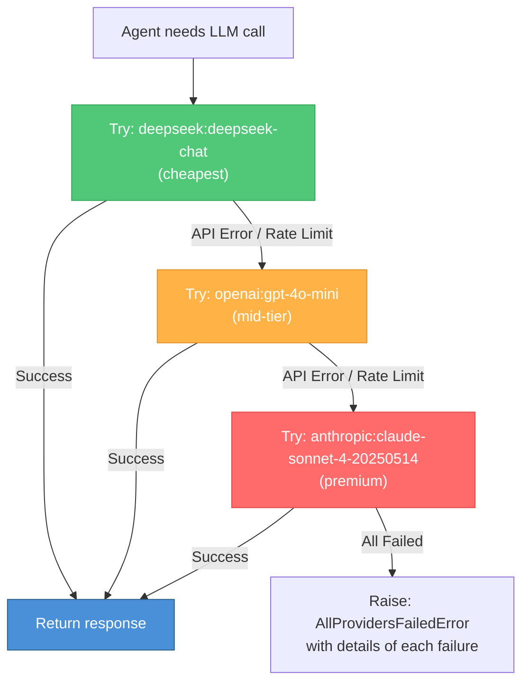
```mermaid
graph TB
    Start["Agent needs LLM call"] --> Try1["Try: deepseek:deepseek-chat<br/>(cheapest)"]

    Try1 -->|Success| Done["Return response"]
    Try1 -->|API Error / Rate Limit| Try2["Try: openai:gpt-4o-mini<br/>(mid-tier)"]

    Try2 -->|Success| Done
    Try2 -->|API Error / Rate Limit| Try3["Try: anthropic:claude-sonnet-4-20250514<br/>(premium)"]

    Try3 -->|Success| Done
    Try3 -->|All Failed| Error["Raise: AllProvidersFailedError<br/>with details of each failure"]

    style Try1 fill:#50C878,stroke:#30A858,color:#fff
    style Try2 fill:#FFB347,stroke:#DF9327,color:#fff
    style Try3 fill:#FF6B6B,stroke:#DF4B4B,color:#fff
    style Done fill:#4A90D9,stroke:#2C5F8A,color:#fff
```

#### API

```python
from pop import Agent
from pop.models import model, register_provider

# Simple: provider:model string
agent = Agent(model="openai:gpt-4o")
agent = Agent(model="anthropic:claude-sonnet-4-20250514")
agent = Agent(model="deepseek:deepseek-chat")

# Explicit configuration
agent = Agent(
    model=model(
        provider="openai",
        name="gpt-4o",
        api_key="sk-...",          # or from env: OPENAI_API_KEY
        base_url="https://...",    # optional custom endpoint
        temperature=0.7,
        max_tokens=4096,
    )
)

# Model fallback chain (try cheap first, fall back to expensive)
agent = Agent(
    model=[
        "deepseek:deepseek-chat",       # try first (cheapest)
        "openai:gpt-4o-mini",           # fallback
        "anthropic:claude-sonnet-4-20250514",  # final fallback
    ]
)

# Model routing (different models for different steps)
agent = Agent(
    model="deepseek:deepseek-chat",           # default (cheap, fast)
    planning_model="anthropic:claude-sonnet-4-20250514",  # for planning steps
)

# Register a custom OpenAI-compatible provider
register_provider(
    name="my-company",
    base_url="https://llm.mycompany.com/v1",
    api_key_env="MY_COMPANY_API_KEY",
    protocol="openai",  # uses OpenAI-compatible API
)
agent = Agent(model="my-company:internal-model-v2")
```

---

### 5.4 Memory Architecture (Markdown-Based, No DB)

#### Design Decision: Why Markdown Files, Not Databases

This is one of pop's most opinionated design choices, so it deserves thorough explanation.

**The conventional approach** in frameworks like LangChain is to use SQLite, Redis, PostgreSQL, or a vector database for agent memory. LangGraph's checkpoint system alone is 8,628 lines with separate packages for each backend (`langgraph-checkpoint-postgres`, `langgraph-checkpoint-sqlite`).

**pop's approach:** Memory is stored as markdown files with YAML frontmatter in a directory on disk.

| Factor | Database Approach | Markdown Files Approach |
|--------|------------------|------------------------|
| **Dependencies** | Requires SQLite/Redis/Postgres driver | Zero additional deps (filesystem only) |
| **Operational complexity** | Must manage DB connections, migrations, schema | `mkdir` and `echo` |
| **Human readability** | Need SQL client or Redis CLI to inspect | Open in any text editor, cat, grep |
| **Git compatibility** | Binary or opaque formats | Full git diff, blame, history |
| **Portability** | Need DB backup/restore | Copy the directory |
| **Search** | SQL queries or vector similarity | `grep -r` or simple text search |
| **Performance** | Better for >10K entries | Sufficient for <10K entries (covers 99% of agent use cases) |
| **Setup time** | Install driver, create DB, run migrations | None |
| **Debugging** | Query the database | Read the files |

**When would you outgrow markdown files?** If your agent manages >10,000 memory entries or needs sub-millisecond retrieval across millions of documents, you should bring your own database. Pop's memory interface is a simple protocol — you can implement a Redis or vector DB backend in ~50 lines. But the default should serve the vast majority of users without adding a single dependency.

**This philosophy is consistent with the framework's values:** keep things lean, readable, and zero-dependency. Claude Code itself uses markdown files for memory (see `~/.claude/projects/*/memory/`) — if it's good enough for an AI coding assistant, it's good enough for most agents.

#### Memory Tier Architecture

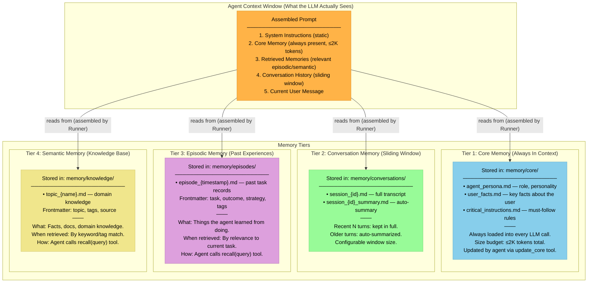
```mermaid
graph TB
    subgraph "Agent Context Window (What the LLM Actually Sees)"
        CW["Assembled Prompt<br/>─────────────────────────<br/>1. System Instructions (static)<br/>2. Core Memory (always present, ≤2K tokens)<br/>3. Retrieved Memories (relevant episodic/semantic)<br/>4. Conversation History (sliding window)<br/>5. Current User Message"]
    end

    subgraph "Memory Tiers"
        direction TB

        subgraph "Tier 1: Core Memory (Always In Context)"
            CM["Stored in: memory/core/<br/>─────────────────────────<br/>• agent_persona.md — role, personality<br/>• user_facts.md — key facts about the user<br/>• critical_instructions.md — must-follow rules<br/>───<br/>Always loaded into every LLM call.<br/>Size budget: ≤2K tokens total.<br/>Updated by agent via update_core tool."]
        end

        subgraph "Tier 2: Conversation Memory (Sliding Window)"
            CONV["Stored in: memory/conversations/<br/>─────────────────────────<br/>• session_{id}.md — full transcript<br/>• session_{id}_summary.md — auto-summary<br/>───<br/>Recent N turns: kept in full.<br/>Older turns: auto-summarized.<br/>Configurable window size."]
        end

        subgraph "Tier 3: Episodic Memory (Past Experiences)"
            EM["Stored in: memory/episodes/<br/>─────────────────────────<br/>• episode_{timestamp}.md — past task records<br/>  Frontmatter: task, outcome, strategy, tags<br/>───<br/>What: Things the agent learned from doing.<br/>When retrieved: By relevance to current task.<br/>How: Agent calls recall(query) tool."]
        end

        subgraph "Tier 4: Semantic Memory (Knowledge Base)"
            SM["Stored in: memory/knowledge/<br/>─────────────────────────<br/>• topic_{name}.md — domain knowledge<br/>  Frontmatter: topic, tags, source<br/>───<br/>What: Facts, docs, domain knowledge.<br/>When retrieved: By keyword/tag match.<br/>How: Agent calls recall(query) tool."]
        end
    end

    CW -->|"reads from (assembled by Runner)"| CM & CONV & EM & SM

    style CW fill:#FFB347,stroke:#DF9327,color:#000
    style CM fill:#87CEEB,stroke:#67AECB,color:#000
    style CONV fill:#98FB98,stroke:#78DB78,color:#000
    style EM fill:#DDA0DD,stroke:#BD80BD,color:#000
    style SM fill:#F0E68C,stroke:#D0C66C,color:#000
```

#### Memory File Format

Every memory file is a markdown file with YAML frontmatter. This makes them human-readable, grep-searchable, and git-friendly.

```
memory/
├── core/
│   ├── agent_persona.md          # Always in context
│   └── user_facts.md             # Always in context
├── conversations/
│   ├── session_20260323_001.md    # Full transcript
│   └── session_20260323_001_summary.md  # Auto-summary
├── episodes/
│   ├── episode_20260323_143022.md # Past task record
│   └── episode_20260322_091500.md # Another past task
└── knowledge/
    ├── topic_python_packaging.md  # Domain knowledge
    └── topic_ai_frameworks.md     # Domain knowledge
```

Example memory file:

```markdown
---
type: episode
task: "Research AI chip market trends"
outcome: success
strategy: "Used web search first, then financial data APIs. Self-corrected when initial search was too broad."
tags: [research, market-analysis, self-correction]
timestamp: 2026-03-23T14:30:22Z
cost_usd: 0.045
steps: 8
---

## What Happened

The user asked for AI chip market analysis. Initial search for "AI chips 2025" returned too many generic results. Narrowed to specific companies (NVIDIA, AMD, Intel) which yielded better data. Self-corrected when I forgot to include Chinese competitors (Huawei, Biren).

## What I Learned

- Start market research with specific companies, not broad topics
- Always check for regional competitors (especially China in chip market)
- Financial data APIs give more reliable numbers than news articles
```

#### Memory Retrieval Flow

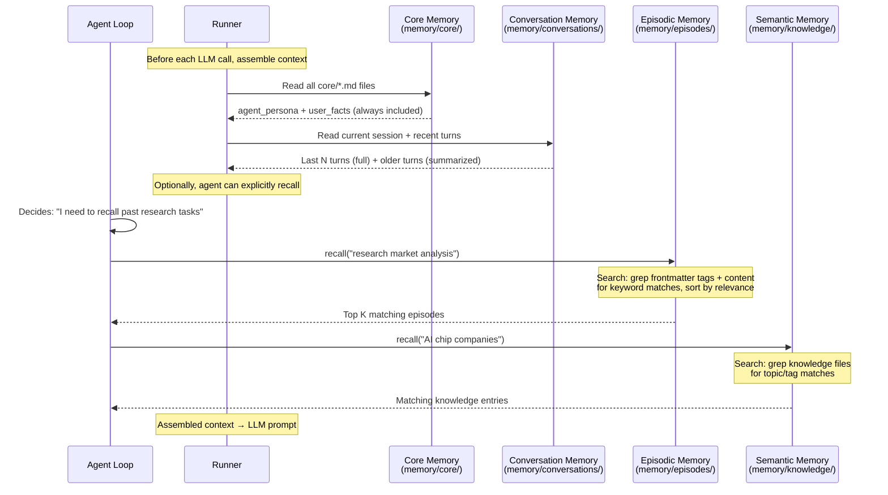
```mermaid
sequenceDiagram
    participant Agent as Agent Loop
    participant Runner as Runner
    participant Core as Core Memory<br/>(memory/core/)
    participant Conv as Conversation Memory<br/>(memory/conversations/)
    participant Episodic as Episodic Memory<br/>(memory/episodes/)
    participant Semantic as Semantic Memory<br/>(memory/knowledge/)

    Note over Runner: Before each LLM call, assemble context

    Runner->>Core: Read all core/*.md files
    Core-->>Runner: agent_persona + user_facts (always included)

    Runner->>Conv: Read current session + recent turns
    Conv-->>Runner: Last N turns (full) + older turns (summarized)

    Note over Runner: Optionally, agent can explicitly recall

    Agent->>Agent: Decides: "I need to recall past research tasks"
    Agent->>Episodic: recall("research market analysis")
    Note over Episodic: Search: grep frontmatter tags + content<br/>for keyword matches, sort by relevance
    Episodic-->>Agent: Top K matching episodes

    Agent->>Semantic: recall("AI chip companies")
    Note over Semantic: Search: grep knowledge files<br/>for topic/tag matches
    Semantic-->>Agent: Matching knowledge entries

    Note over Runner: Assembled context → LLM prompt
```

#### Memory Write Flow

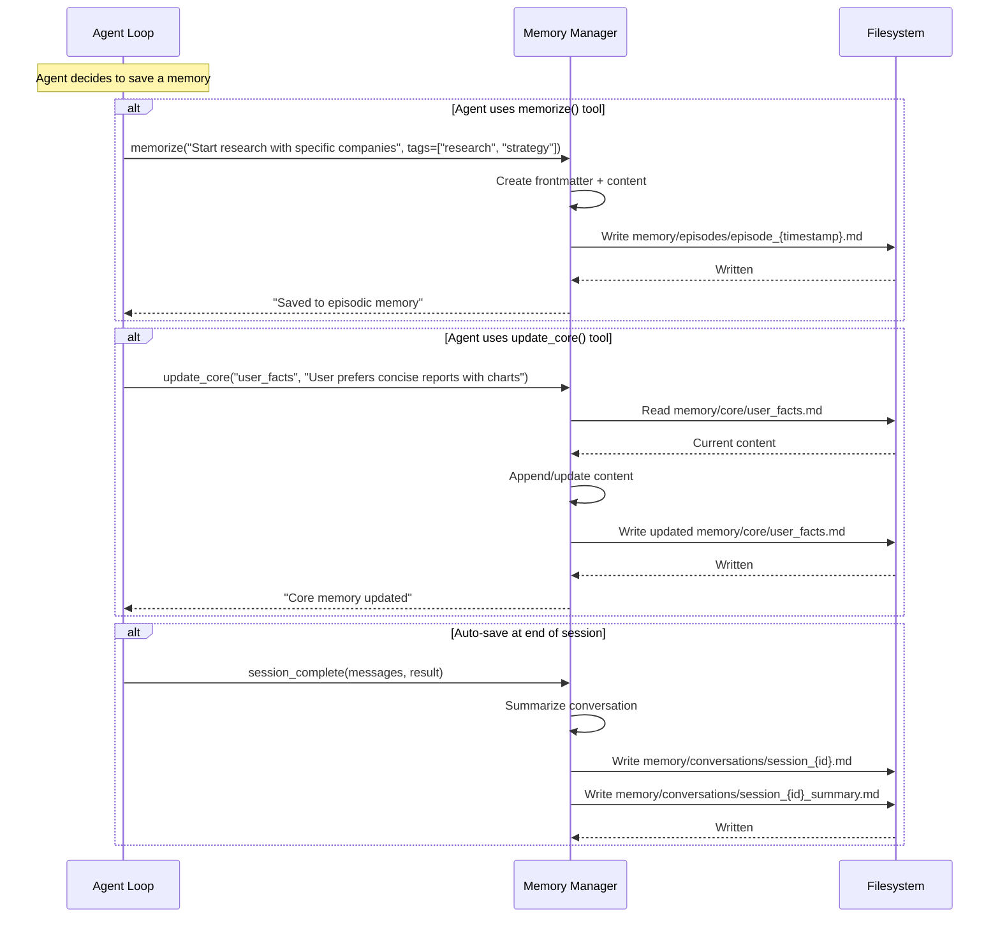
```mermaid
sequenceDiagram
    participant Agent as Agent Loop
    participant Memory as Memory Manager
    participant FS as Filesystem

    Note over Agent: Agent decides to save a memory

    alt Agent uses memorize() tool
        Agent->>Memory: memorize("Start research with specific companies", tags=["research", "strategy"])
        Memory->>Memory: Create frontmatter + content
        Memory->>FS: Write memory/episodes/episode_{timestamp}.md
        FS-->>Memory: Written
        Memory-->>Agent: "Saved to episodic memory"
    end

    alt Agent uses update_core() tool
        Agent->>Memory: update_core("user_facts", "User prefers concise reports with charts")
        Memory->>FS: Read memory/core/user_facts.md
        FS-->>Memory: Current content
        Memory->>Memory: Append/update content
        Memory->>FS: Write updated memory/core/user_facts.md
        FS-->>Memory: Written
        Memory-->>Agent: "Core memory updated"
    end

    alt Auto-save at end of session
        Agent->>Memory: session_complete(messages, result)
        Memory->>Memory: Summarize conversation
        Memory->>FS: Write memory/conversations/session_{id}.md
        Memory->>FS: Write memory/conversations/session_{id}_summary.md
        FS-->>Memory: Written
    end
```

#### API

```python
from pop import Agent
from pop.memory import MarkdownMemory

# Default: in-memory only (no persistence, simplest)
agent = Agent(model="openai:gpt-4o", tools=[...])

# With persistent markdown memory
agent = Agent(
    model="openai:gpt-4o",
    tools=[...],
    memory=MarkdownMemory("./agent_memory/"),  # directory path
)

# Core memory (always in context)
agent = Agent(
    model="openai:gpt-4o",
    core_memory={
        "user": "Name: Alice. Preferences: concise answers, code examples.",
        "project": "Working on an e-commerce platform using FastAPI + React.",
    },
)

# The agent can self-manage memory via built-in tools:
# - memorize(content, tags) — save to episodic memory
# - recall(query, top_k) — retrieve from episodic/semantic memory
# - update_core(key, content) — update core memory

# Conversation memory config
agent = Agent(
    model="openai:gpt-4o",
    conversation_window=20,              # keep last 20 turns full
    auto_summarize=True,                 # summarize older turns
)
```

---

### 5.5 Runner (Execution Engine)

#### What It Does and Why It's Separate from Agent

**Rationale:** The Runner is separated from the Agent because execution concerns (sync vs async, streaming, parallelism, timeouts, cost tracking) are orthogonal to reasoning concerns (think, act, observe). This separation means:

1. The Agent class stays focused on the reasoning loop (~200 lines)
2. The Runner can execute agents in different modes without changing Agent code
3. Testing is easier — you can unit-test the Agent loop with a mock Runner

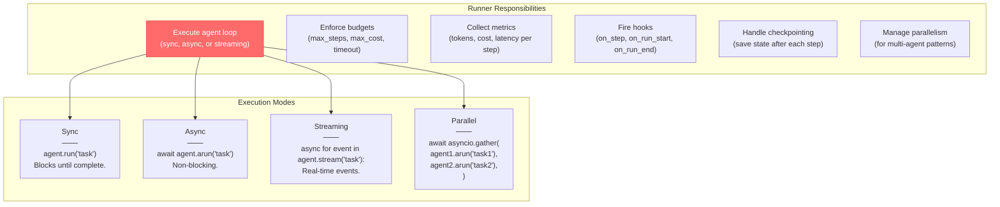
```mermaid
graph TB
    subgraph "Runner Responsibilities"
        direction TB
        R1["Execute agent loop<br/>(sync, async, or streaming)"]
        R2["Enforce budgets<br/>(max_steps, max_cost, timeout)"]
        R3["Collect metrics<br/>(tokens, cost, latency per step)"]
        R4["Fire hooks<br/>(on_step, on_run_start, on_run_end)"]
        R5["Handle checkpointing<br/>(save state after each step)"]
        R6["Manage parallelism<br/>(for multi-agent patterns)"]
    end

    subgraph "Execution Modes"
        direction LR
        M1["Sync<br/>───<br/>agent.run('task')<br/>Blocks until complete."]
        M2["Async<br/>───<br/>await agent.arun('task')<br/>Non-blocking."]
        M3["Streaming<br/>───<br/>async for event in agent.stream('task'):<br/>Real-time events."]
        M4["Parallel<br/>───<br/>await asyncio.gather(<br/>  agent1.arun('task1'),<br/>  agent2.arun('task2'),<br/>)"]
    end

    R1 --> M1 & M2 & M3 & M4

    style R1 fill:#FF6B6B,stroke:#DF4B4B,color:#fff
```

#### Streaming Event Flow

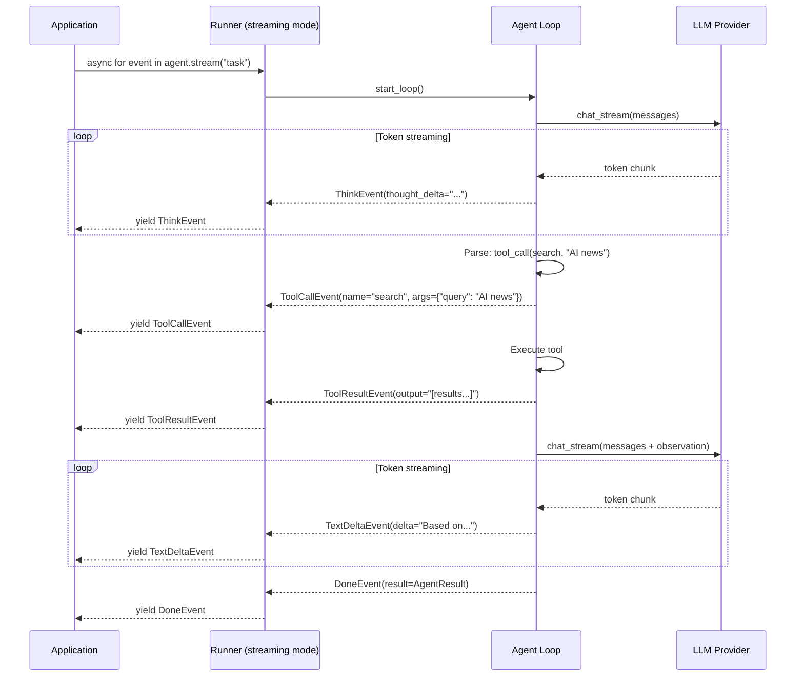
```mermaid
sequenceDiagram
    participant App as Application
    participant Runner as Runner (streaming mode)
    participant Agent as Agent Loop
    participant LLM as LLM Provider

    App->>Runner: async for event in agent.stream("task")

    Runner->>Agent: start_loop()

    Agent->>LLM: chat_stream(messages)

    loop Token streaming
        LLM-->>Agent: token chunk
        Agent-->>Runner: ThinkEvent(thought_delta="...")
        Runner-->>App: yield ThinkEvent
    end

    Agent->>Agent: Parse: tool_call(search, "AI news")
    Agent-->>Runner: ToolCallEvent(name="search", args={"query": "AI news"})
    Runner-->>App: yield ToolCallEvent

    Agent->>Agent: Execute tool
    Agent-->>Runner: ToolResultEvent(output="[results...]")
    Runner-->>App: yield ToolResultEvent

    Agent->>LLM: chat_stream(messages + observation)

    loop Token streaming
        LLM-->>Agent: token chunk
        Agent-->>Runner: TextDeltaEvent(delta="Based on...")
        Runner-->>App: yield TextDeltaEvent
    end

    Agent-->>Runner: DoneEvent(result=AgentResult)
    Runner-->>App: yield DoneEvent
```

#### API

```python
# Sync (blocking)
result = agent.run("Summarize today's news")

# Async (non-blocking)
result = await agent.arun("Summarize today's news")

# Streaming (real-time events)
async for event in agent.stream("Summarize today's news"):
    match event:
        case ThinkEvent(thought=t):     print(f"Thinking: {t}")
        case ToolCallEvent(name=n):     print(f"Calling: {n}")
        case ToolResultEvent(output=o): print(f"Result: {o}")
        case TextDeltaEvent(delta=d):   print(d, end="")
        case DoneEvent(result=r):       print(f"\nDone! Cost: ${r.cost}")

# With step budget
result = agent.run("Complex task", max_steps=10)

# With human-in-the-loop
result = agent.run(
    "Deploy the feature",
    confirm_before=["deploy", "delete"],  # require confirmation for these tools
)
```

---

### 5.6 State Management

#### Design: Simple, Explicit, No Hidden Channels

**Rationale:** LangGraph uses 9 different channel types (`LastValue`, `BinaryOperatorAggregate`, `EphemeralValue`, `NamedBarrierValue`, `Topic`, `AnyValue`, `UntrackedValue`, etc.) for what is conceptually "passing state between functions." Its `Pregel` engine manages state transitions through these channels. This is an abstraction from distributed graph processing research (Google's Pregel paper) that is dramatically over-engineered for most LLM agent workloads.

Pop uses a simple dataclass for state. State transitions are explicit. You can print the state at any time and understand exactly what's happening.

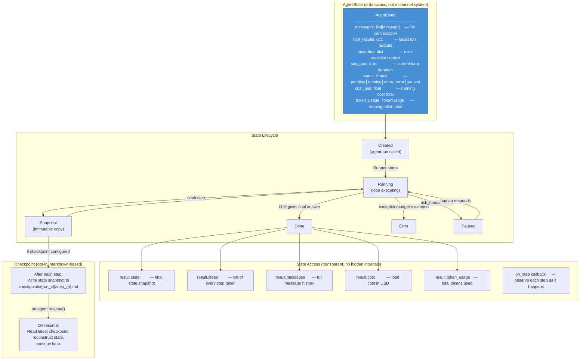
```mermaid
graph TB
    subgraph "AgentState (a dataclass, not a channel system)"
        AS["AgentState<br/>─────────────────────<br/>messages: list[Message]    — full conversation<br/>tool_results: dict          — latest tool outputs<br/>metadata: dict              — user-provided context<br/>step_count: int             — current loop iteration<br/>status: Status              — pending│running│done│error│paused<br/>cost_usd: float             — running cost total<br/>token_usage: TokenUsage     — running token total"]
    end

    subgraph "State Lifecycle"
        direction LR
        SL1["Created<br/>(agent.run called)"] -->|"Runner starts"| SL2["Running<br/>(loop executing)"]
        SL2 -->|"each step"| SL3["Snapshot<br/>(immutable copy)"]
        SL3 --> SL2
        SL2 -->|"LLM gives final answer"| SL4["Done"]
        SL2 -->|"exception/budget exceeded"| SL5["Error"]
        SL2 -->|"ask_human called"| SL6["Paused"]
        SL6 -->|"human responds"| SL2
    end

    subgraph "State Access (transparent, no hidden internals)"
        SA1["result.state         — final state snapshot"]
        SA2["result.steps         — list of every step taken"]
        SA3["result.messages      — full message history"]
        SA4["result.cost          — total cost in USD"]
        SA5["result.token_usage   — total tokens used"]
        SA6["on_step callback     — observe each step as it happens"]
    end

    subgraph "Checkpoint (opt-in, markdown-based)"
        direction LR
        CP1["After each step:<br/>Write state snapshot to<br/>checkpoints/{run_id}/step_{n}.md"]
        CP2["On resume:<br/>Read latest checkpoint,<br/>reconstruct state,<br/>continue loop."]
    end

    AS --> SL1
    SL4 --> SA1 & SA2 & SA3 & SA4 & SA5
    SL3 -.->|"if checkpoint configured"| CP1
    CP1 -.->|"on agent.resume()"| CP2

    style AS fill:#4A90D9,stroke:#2C5F8A,color:#fff
```

#### Step Record Schema

Every step in the agent loop produces an immutable record. This is the bridge between runtime behavior and eval metrics.

```python
@dataclass(frozen=True)
class Step:
    index: int                          # 0, 1, 2, ...
    timestamp: datetime                 # when this step started
    thought: str | None                 # LLM's reasoning (if exposed)
    action: Action                      # tool_call, final_answer, or ask_human
    tool_name: str | None               # which tool was called (if any)
    tool_args: dict | None              # arguments passed to tool
    tool_result: str | None             # what the tool returned
    error: str | None                   # error message (if step failed)
    recovery_action: str | None         # what recovery was taken
    token_usage: TokenUsage             # tokens consumed in this step
    cost_usd: float                     # cost of this step
    latency_ms: float                   # wall-clock time of this step
    model_used: str                     # which model was actually used (relevant for fallback)
```

**Why this matters:** This schema is directly consumed by the eval harness. Every eval dimension maps to fields in this record:
- **Task accuracy** → final step's action (was the answer correct?)
- **Cost efficiency** → sum of `cost_usd` across steps
- **Latency** → sum of `latency_ms` minus LLM time = framework overhead
- **Reliability** → presence of `error` + `recovery_action` fields
- **Tool calling accuracy** → `tool_name` + `tool_args` vs optimal sequence

---

### 5.7 Error Handling & Recovery

#### Error Taxonomy

**Rationale:** LangChain/LangGraph's error handling is often opaque. Error codes like `INVALID_CONCURRENT_GRAPH_UPDATE` or messages like "Raised when attempting to update a channel with an invalid set of updates" tell users nothing about what they did wrong. Pop uses an explicit error taxonomy where every error class has a defined recovery strategy.

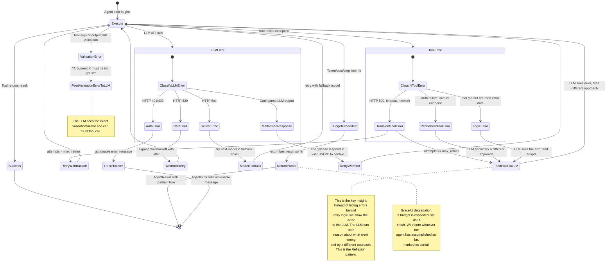
```mermaid
stateDiagram-v2
    [*] --> Execute: Agent step begins

    Execute --> Success: Tool returns result
    Execute --> ToolError: Tool raises exception
    Execute --> LLMError: LLM API fails
    Execute --> ValidationError: Tool args or output fails validation
    Execute --> BudgetExceeded: Token/cost/step limit hit

    state ToolError {
        [*] --> ClassifyToolError
        ClassifyToolError --> TransientToolError: HTTP 500, timeout, network
        ClassifyToolError --> PermanentToolError: Auth failure, invalid endpoint
        ClassifyToolError --> LogicError: Tool ran but returned error data
    }

    TransientToolError --> RetryWithBackoff: attempts < max_retries
    TransientToolError --> FeedErrorToLLM: attempts >= max_retries
    PermanentToolError --> FeedErrorToLLM: LLM should try a different approach
    LogicError --> FeedErrorToLLM: LLM sees the error and adapts

    state LLMError {
        [*] --> ClassifyLLMError
        ClassifyLLMError --> RateLimit: HTTP 429
        ClassifyLLMError --> ServerError: HTTP 5xx
        ClassifyLLMError --> AuthError: HTTP 401/403
        ClassifyLLMError --> MalformedResponse: Can't parse LLM output
    }

    RateLimit --> WaitAndRetry: exponential backoff with jitter
    ServerError --> ModelFallback: try next model in fallback chain
    AuthError --> RaiseToUser: actionable error message
    MalformedResponse --> RetryWithHint: add "please respond in valid JSON" to context

    ValidationError --> FeedValidationErrorToLLM: "Argument X must be int, got str"
    Note right of FeedValidationErrorToLLM: The LLM sees the exact validation\nerror and can fix its tool call.

    BudgetExceeded --> ReturnPartial: return best result so far

    RetryWithBackoff --> Execute
    FeedErrorToLLM --> Execute: LLM sees error, tries different approach
    WaitAndRetry --> Execute
    ModelFallback --> Execute: retry with fallback model
    RetryWithHint --> Execute

    Success --> [*]
    ReturnPartial --> [*]: AgentResult with partial=True
    RaiseToUser --> [*]: AgentError with actionable message

    note right of FeedErrorToLLM
        This is the key insight:
        Instead of hiding errors behind
        retry logic, we show the error
        to the LLM. The LLM can then
        reason about what went wrong
        and try a different approach.
        This is the Reflexion pattern.
    end note

    note right of ReturnPartial
        Graceful degradation:
        If budget is exceeded, we don't
        crash. We return whatever the
        agent has accomplished so far,
        marked as partial.
    end note
```

#### Recovery Strategy Matrix

| Error Class | Example | Recovery Strategy | Rationale |
|------------|---------|-------------------|-----------|
| **Transient tool error** | HTTP 500 from search API | Retry with exponential backoff + jitter (max 3 attempts) | Transient errors are temporary by definition. Backoff prevents hammering the service. Jitter prevents thundering herd. |
| **Permanent tool error** | Auth failure, invalid endpoint | Feed error to LLM — it should try a different tool or approach | The tool is broken. Retrying won't help. But the LLM might know an alternative. |
| **Logic error** | Tool returns "No results found" | Feed result to LLM — it should refine its query | Not really an error — the tool worked, the query was bad. LLM can improve it. |
| **Rate limit** | HTTP 429 from LLM provider | Wait (respect `Retry-After` header) then retry | Provider will accept the request again after the wait period. |
| **LLM server error** | HTTP 500 from LLM provider | Try next model in fallback chain | Provider might be down. Another provider might be up. |
| **Auth error** | Invalid API key | Raise to user with actionable message: "Set OPENAI_API_KEY env var" | Can't recover programmatically. User needs to fix their config. |
| **Malformed response** | LLM returns invalid JSON for tool call | Retry with hint: "Please respond in valid JSON format" | Usually a one-off. Adding the hint to context almost always fixes it. |
| **Validation error** | LLM passes string where int expected | Feed validation error to LLM: "Argument 'count' must be int, got '5'" | The LLM can fix this immediately once it sees the specific error. |
| **Budget exceeded** | Hit max_steps or max_cost | Return partial result with `partial=True` flag | User gets something rather than nothing. Can inspect what was accomplished. |

---

### 5.8 Hook System (Opt-In Middleware)

#### Architecture

**Rationale:** LangChain's callback and tracer systems are always loaded, adding 7,754 lines of code (2,697 for callbacks + 5,057 for tracers) to every invocation, even when unused. Pop's hook system is a simple protocol: if you don't register any hooks, there is zero overhead — no callback managers, no tracer initialization, no schema introspection.

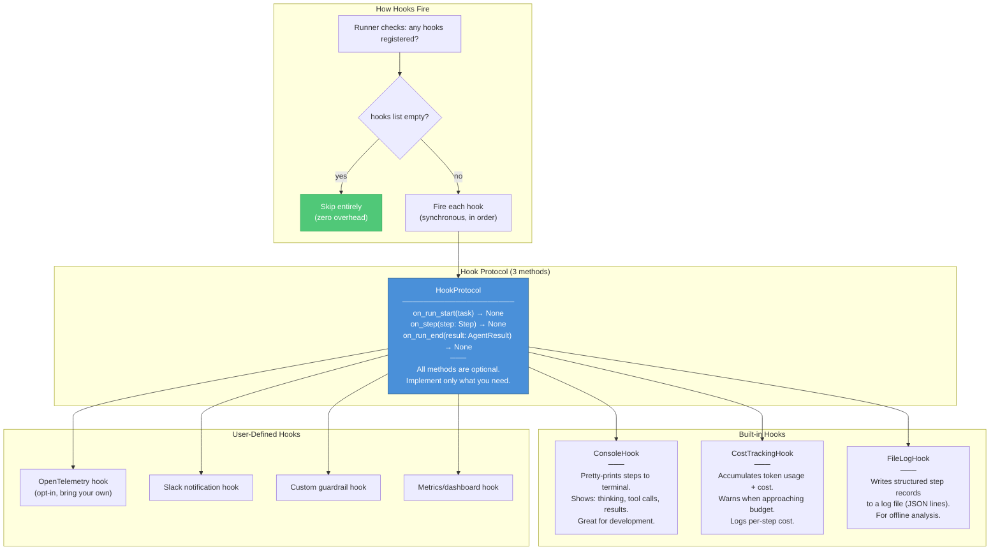
```mermaid
graph TB
    subgraph "Hook Protocol (3 methods)"
        HP["HookProtocol<br/>─────────────────────<br/>on_run_start(task) → None<br/>on_step(step: Step) → None<br/>on_run_end(result: AgentResult) → None<br/>───<br/>All methods are optional.<br/>Implement only what you need."]
    end

    subgraph "Built-in Hooks"
        direction TB
        BH1["ConsoleHook<br/>───<br/>Pretty-prints steps to terminal.<br/>Shows: thinking, tool calls, results.<br/>Great for development."]
        BH2["CostTrackingHook<br/>───<br/>Accumulates token usage + cost.<br/>Warns when approaching budget.<br/>Logs per-step cost."]
        BH3["FileLogHook<br/>───<br/>Writes structured step records<br/>to a log file (JSON lines).<br/>For offline analysis."]
    end

    subgraph "User-Defined Hooks"
        direction TB
        UH1["OpenTelemetry hook<br/>(opt-in, bring your own)"]
        UH2["Slack notification hook"]
        UH3["Custom guardrail hook"]
        UH4["Metrics/dashboard hook"]
    end

    subgraph "How Hooks Fire"
        direction TB
        HF1["Runner checks: any hooks registered?"]
        HF2{"hooks list empty?"}
        HF3["Skip entirely<br/>(zero overhead)"]
        HF4["Fire each hook<br/>(synchronous, in order)"]

        HF1 --> HF2
        HF2 -->|yes| HF3
        HF2 -->|no| HF4
    end

    HP --> BH1 & BH2 & BH3
    HP --> UH1 & UH2 & UH3 & UH4
    HF4 --> HP

    style HP fill:#4A90D9,stroke:#2C5F8A,color:#fff
    style HF3 fill:#50C878,stroke:#30A858,color:#fff
```

#### Hook Lifecycle

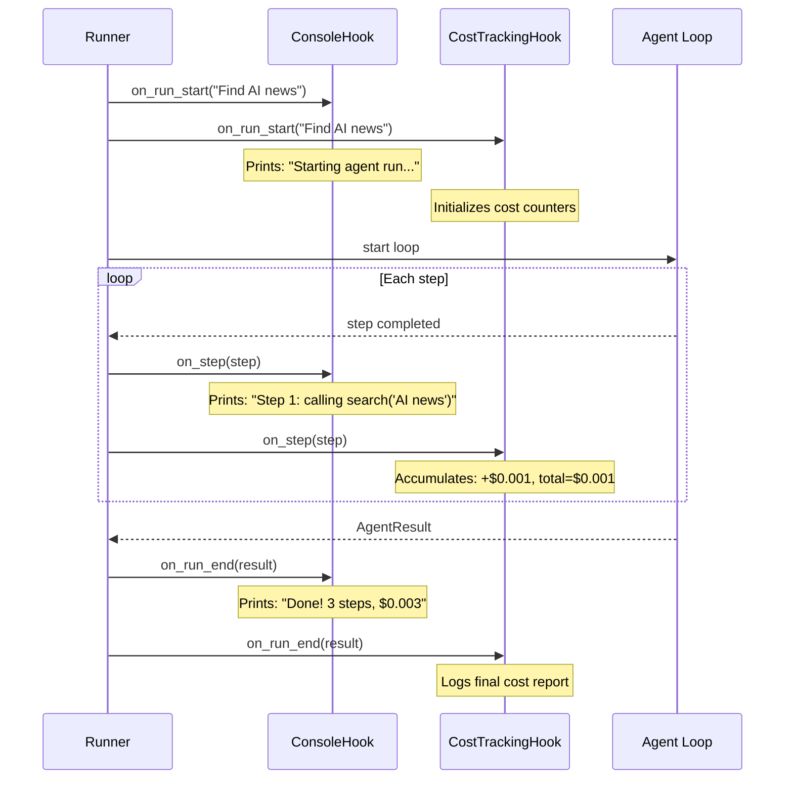
```mermaid
sequenceDiagram
    participant Runner as Runner
    participant Hook1 as ConsoleHook
    participant Hook2 as CostTrackingHook
    participant Agent as Agent Loop

    Runner->>Hook1: on_run_start("Find AI news")
    Runner->>Hook2: on_run_start("Find AI news")
    Note over Hook1: Prints: "Starting agent run..."
    Note over Hook2: Initializes cost counters

    Runner->>Agent: start loop

    loop Each step
        Agent-->>Runner: step completed

        Runner->>Hook1: on_step(step)
        Note over Hook1: Prints: "Step 1: calling search('AI news')"

        Runner->>Hook2: on_step(step)
        Note over Hook2: Accumulates: +$0.001, total=$0.001
    end

    Agent-->>Runner: AgentResult

    Runner->>Hook1: on_run_end(result)
    Note over Hook1: Prints: "Done! 3 steps, $0.003"

    Runner->>Hook2: on_run_end(result)
    Note over Hook2: Logs final cost report
```

---

## 6. Multi-Agent Orchestration

### Pattern Catalog

Pop supports 5 multi-agent patterns, ordered from simplest to most complex. Following Anthropic's recommendation: **always use the simplest pattern that works.**

```mermaid
graph TB
    subgraph "Pattern 1: Sequential Pipeline"
        direction LR
        S1["Agent A<br/>(Researcher)"] -->|"findings"| S2["Agent B<br/>(Writer)"] -->|"draft"| S3["Agent C<br/>(Editor)"]
    end

    subgraph "Pattern 2: Handoff (Swarm-style)"
        direction LR
        H1["Triage Agent"] -->|"handoff('billing')"| H2["Billing Agent"]
        H1 -->|"handoff('tech')"| H3["Tech Agent"]
        H1 -->|"handoff('sales')"| H4["Sales Agent"]
    end

    subgraph "Pattern 3: Orchestrator-Workers"
        direction TB
        O1["Orchestrator"]
        O1 -->|"delegate"| W1["Research Worker"]
        O1 -->|"delegate"| W2["Code Worker"]
        O1 -->|"delegate"| W3["Review Worker"]
        W1 & W2 & W3 -->|"results"| O1
    end

    subgraph "Pattern 4: Debate / Verification"
        direction LR
        D1["Generator"] -->|"proposal"| D2["Critic"]
        D2 -->|"feedback"| D1
        D2 -->|"approved"| D3["Final Output"]
    end

    subgraph "Pattern 5: Parallel Fan-Out"
        direction TB
        P1["Coordinator"]
        P1 -->|"same task"| PA1["Agent A"]
        P1 -->|"same task"| PA2["Agent B"]
        P1 -->|"same task"| PA3["Agent C"]
        PA1 & PA2 & PA3 -->|"vote/merge"| P1
    end

    style O1 fill:#FF6B6B,stroke:#DF4B4B,color:#fff
    style H1 fill:#4A90D9,stroke:#2C5F8A,color:#fff
    style P1 fill:#50C878,stroke:#30A858,color:#fff
```

### Pattern 1: Sequential Pipeline (Detailed Flow)

**When to use:** When work flows in one direction through specialized stages, like an assembly line.

**Rationale:** This is the simplest multi-agent pattern. Each agent does one thing well and passes its output to the next. There's no coordination overhead — it's just function composition with agents.

```mermaid
sequenceDiagram
    participant App as Application
    participant P as pipeline()
    participant R as Researcher Agent
    participant W as Writer Agent
    participant E as Editor Agent

    App->>P: pipeline([researcher, writer, editor], task="Blog about AI chips")

    P->>R: run("Blog about AI chips")
    Note over R: Searches web, gathers sources,<br/>creates structured findings
    R-->>P: findings = "NVIDIA leads with H100..."

    P->>W: run("Write blog post based on: {findings}")
    Note over W: Takes findings, produces<br/>draft blog post with structure
    W-->>P: draft = "# The AI Chip Race in 2025..."

    P->>E: run("Edit and polish: {draft}")
    Note over E: Fixes grammar, improves flow,<br/>ensures consistency
    E-->>P: final = "# The AI Chip Race in 2025... (polished)"

    P-->>App: PipelineResult(output=final, steps=[r_result, w_result, e_result])
```

### Pattern 2: Handoff (Detailed Flow)

**When to use:** Customer support, routing, any scenario where the right specialist depends on the input.

**Rationale:** Inspired by OpenAI's Swarm pattern. The triage agent classifies the input and hands off to a specialist. The specialist has its own tools and instructions optimized for its domain. Handoff is a tool — the triage agent calls `handoff("billing")` the same way it would call any other tool.

```mermaid
sequenceDiagram
    participant User as User
    participant Triage as Triage Agent
    participant LLM1 as LLM (Triage)
    participant Billing as Billing Agent
    participant LLM2 as LLM (Billing)
    participant DB as Database

    User->>Triage: "I was charged twice for my subscription"

    Triage->>LLM1: Classify intent
    LLM1-->>Triage: tool_call: handoff("billing")

    Note over Triage,Billing: Handoff transfers context + user message to Billing Agent

    Billing->>LLM2: "User says: charged twice. Check billing records."
    LLM2-->>Billing: tool_call: lookup_invoice(user_id=123)

    Billing->>DB: SELECT * FROM invoices WHERE user_id=123
    DB-->>Billing: Invoice #1234 ($29.99), Invoice #1235 ($29.99, duplicate)

    Billing->>LLM2: Found duplicate charge. Process refund?
    LLM2-->>Billing: tool_call: process_refund(invoice_id=1235)

    Billing->>DB: UPDATE invoices SET status='refunded' WHERE id=1235
    DB-->>Billing: Refund processed

    Billing->>LLM2: Refund complete. Compose response.
    LLM2-->>Billing: final_answer

    Billing-->>User: "I found a duplicate charge of $29.99. Refund for Invoice #1235 has been processed. You'll see it in 3-5 business days."
```

### Pattern 3: Orchestrator-Workers (Detailed Flow)

**When to use:** Complex tasks that benefit from parallel specialization.

```mermaid
sequenceDiagram
    participant User as User
    participant Orch as Orchestrator Agent
    participant LLM as LLM (Orchestrator)
    participant RW as Research Worker
    participant CW as Code Worker
    participant QW as QA Worker

    User->>Orch: "Build a REST API for user management"

    Orch->>LLM: Decompose task into subtasks
    LLM-->>Orch: Plan: 1) Research best practices, 2) Write code, 3) Write tests

    par Parallel execution
        Orch->>RW: "Research REST API best practices for user management"
        Note over RW: Searches, reads docs,<br/>compiles recommendations
        RW-->>Orch: research_results

        Orch->>CW: "Draft FastAPI code for user CRUD endpoints"
        Note over CW: Generates code with<br/>models, routes, validation
        CW-->>Orch: code_package
    end

    Orch->>LLM: Integrate research + code
    LLM-->>Orch: Merged code incorporating best practices

    Orch->>QW: "Review this code for bugs and security issues"
    Note over QW: Runs analysis,<br/>checks OWASP top 10
    QW-->>Orch: qa_findings (2 issues found)

    Orch->>LLM: Fix issues from QA
    LLM-->>Orch: Fixed code

    Orch-->>User: Final code + research report + QA summary
```

### Pattern 4: Debate / Verification (Detailed Flow)

**When to use:** When correctness matters more than speed. Code review, fact-checking, security analysis.

```mermaid
sequenceDiagram
    participant App as Application
    participant D as debate()
    participant Gen as Generator Agent
    participant Critic as Critic Agent

    App->>D: debate(generator, critic, task="Write auth system", max_rounds=3)

    loop Round 1
        D->>Gen: "Write a secure authentication system"
        Gen-->>D: proposal_v1 = "JWT-based auth with..."

        D->>Critic: "Review this auth implementation: {proposal_v1}"
        Critic-->>D: feedback = "Issues: 1) No token rotation, 2) Secret in code, 3) No rate limiting"
    end

    Note over D: Critic found issues → another round

    loop Round 2
        D->>Gen: "Revise your auth system. Feedback: {feedback}"
        Gen-->>D: proposal_v2 = "JWT with rotation, env-based secrets, rate limiting..."

        D->>Critic: "Review revised implementation: {proposal_v2}"
        Critic-->>D: feedback = "Improved. Minor: consider adding refresh token expiry"
    end

    loop Round 3
        D->>Gen: "Final revision. Feedback: {feedback}"
        Gen-->>D: proposal_v3 = "Complete auth with refresh token expiry..."

        D->>Critic: "Final review: {proposal_v3}"
        Critic-->>D: "APPROVED. Implementation is secure and complete."
    end

    D-->>App: DebateResult(output=proposal_v3, rounds=3, approved=True)
```

### Pattern 5: Fan-Out (Detailed Flow)

**When to use:** When you want multiple perspectives on the same question, or redundancy for reliability.

```mermaid
sequenceDiagram
    participant App as Application
    participant FO as fan_out()
    participant A as Analyst A
    participant B as Analyst B
    participant C as Analyst C

    App->>FO: fan_out([analyst_a, analyst_b, analyst_c], task="Key risks?", strategy="merge")

    par All run simultaneously
        FO->>A: "What are the key risks in this investment?"
        A-->>FO: "1) Market risk 2) Regulatory risk 3) Competition"

        FO->>B: "What are the key risks in this investment?"
        B-->>FO: "1) Regulatory risk 2) Execution risk 3) Market timing"

        FO->>C: "What are the key risks in this investment?"
        C-->>FO: "1) Market risk 2) Technology risk 3) Regulatory risk"
    end

    FO->>FO: Merge strategy: combine + deduplicate
    Note over FO: Merged: Market risk (3/3), Regulatory risk (3/3),<br/>Competition (1/3), Execution risk (1/3),<br/>Market timing (1/3), Technology risk (1/3)

    FO-->>App: FanOutResult(output="Top risks: 1) Market (unanimous)...")
```

### Multi-Agent API

```python
from pop import Agent, tool, handoff
from pop.multi import pipeline, orchestrate, debate, fan_out

# ─── Pattern 1: Pipeline ───
result = pipeline(
    agents=[researcher, writer, editor],
    task="Write a blog post about quantum computing",
)

# ─── Pattern 2: Handoff ───
triage = Agent(
    model="openai:gpt-4o-mini",
    instructions="Route the user to the right department.",
    tools=[
        handoff(billing_agent, when="billing or payment issues"),
        handoff(tech_agent, when="technical problems"),
    ],
)
result = triage.run("I was charged twice for my subscription")

# ─── Pattern 3: Orchestrator-Workers ───
result = orchestrate(
    boss=project_manager,
    workers=[researcher, coder, tester],
    task="Build a REST API for user management",
)

# ─── Pattern 4: Debate ───
result = debate(
    generator=writer_agent,
    critic=reviewer_agent,
    task="Write a secure authentication system",
    max_rounds=3,
)

# ─── Pattern 5: Fan-Out ───
result = fan_out(
    agents=[analyst_a, analyst_b, analyst_c],
    task="What are the key risks in this investment?",
    strategy="merge",  # or "vote" for consensus
)
```

---

## 7. Workflow Patterns (Simple → Complex)

Following Anthropic's recommendation: **always use the simplest pattern that works.**

```mermaid
graph TB
    subgraph "Level 0: Single LLM Call"
        L0["model.chat(messages)<br/>───<br/>No agent needed. Just call the model.<br/>Use when: simple Q&A, text generation."]
    end

    subgraph "Level 1: Prompt Chain"
        direction LR
        L1A["Step 1<br/>Extract"] -->|"output"| L1B["Step 2<br/>Transform"] -->|"output"| L1C["Step 3<br/>Format"]
    end

    subgraph "Level 2: Router"
        L2A["Classify Input"]
        L2A -->|"type A"| L2B["Handler A"]
        L2A -->|"type B"| L2C["Handler B"]
        L2A -->|"type C"| L2D["Handler C"]
    end

    subgraph "Level 3: Parallel"
        direction TB
        L3A["Split Task"]
        L3A --> L3B["Subtask 1"] & L3C["Subtask 2"] & L3D["Subtask 3"]
        L3B & L3C & L3D --> L3E["Merge Results"]
    end

    subgraph "Level 4: Agent Loop (ReAct)"
        direction LR
        L4A["Think"] --> L4B["Act"] --> L4C["Observe"] --> L4A
    end

    subgraph "Level 5: Multi-Agent"
        direction TB
        L5A["Orchestrator"] --> L5B["Agent 1"] & L5C["Agent 2"]
        L5B & L5C --> L5A
    end

    L0 -.->|"need multiple steps?"| L1A
    L1A -.->|"need dynamic routing?"| L2A
    L2A -.->|"need parallelism?"| L3A
    L3A -.->|"need tool use / loop?"| L4A
    L4A -.->|"need specialization?"| L5A

    style L0 fill:#98FB98,stroke:#78DB78,color:#000
    style L4A fill:#FFB347,stroke:#DF9327,color:#000
    style L5A fill:#FF6B6B,stroke:#DF4B4B,color:#000
```

**Rationale for progressive complexity:** Most developers start with a simple chat call and only need agents when their task requires tools or multi-step reasoning. Pop provides entry points at every level so you're never over-engineering. LangChain/LangGraph nudge you toward `StateGraph` even for trivial use cases.

### API for Each Level

```python
from pop import Agent, tool
from pop.models import chat
from pop.workflows import chain, route, parallel

# ─── Level 0: Direct model call (no agent needed) ───
response = chat("openai:gpt-4o", "What is 2+2?")

# ─── Level 1: Prompt chain ───
result = chain(
    model="openai:gpt-4o",
    steps=[
        "Extract all dates from this text: {input}",
        "Convert these dates to ISO format: {prev}",
        "Generate a timeline from these dates: {prev}",
    ],
    input=document_text,
)

# ─── Level 2: Router ───
result = route(
    model="openai:gpt-4o-mini",
    input=user_message,
    routes={
        "question": lambda msg: chat("openai:gpt-4o", f"Answer: {msg}"),
        "complaint": lambda msg: escalate_to_human(msg),
        "order":     lambda msg: process_order(msg),
    },
)

# ─── Level 3: Parallel ───
results = parallel(
    model="openai:gpt-4o",
    tasks=[
        "Summarize the financial section",
        "Summarize the technical section",
        "Summarize the market section",
    ],
    context=report_text,
)

# ─── Level 4: Agent (most common entry point) ───
agent = Agent(model="openai:gpt-4o", tools=[search, calculate])
result = agent.run("Research and analyze Q3 earnings")

# ─── Level 5: Multi-Agent (see Section 6) ───
```

---

## 8. Scenario Walkthroughs (End-to-End)

Each scenario includes: a diagram showing every message and decision, the pop code to implement it, and notes on what architectural mechanisms are involved.

### 8.1 Single-Agent Tool-Augmented Question

**Use case:** "Find latest weather in NYC and convert to Celsius."

```mermaid
sequenceDiagram
    participant App as Application
    participant Agent as pop Agent
    participant Model as Model Router
    participant LLM as OpenAI GPT-4o
    participant Tool as Tool Gateway
    participant Hook as CostTrackingHook

    App->>Agent: run("Find weather in NYC, convert to C")
    Agent->>Hook: on_run_start(task)

    rect rgb(240, 248, 255)
        Note over Agent,LLM: Step 1: Reason + select tool
        Agent->>Model: chat(messages + tools=[get_weather, convert_f_to_c])
        Model->>LLM: OpenAI API call
        LLM-->>Model: tool_call(get_weather, city="NYC")
        Model-->>Agent: Normalized tool_call
    end

    rect rgb(255, 248, 240)
        Note over Agent,Tool: Step 1: Execute tool
        Agent->>Tool: validate(get_weather, {city: "NYC"})
        Tool->>Tool: JSON Schema validation: pass
        Tool->>Tool: Execute get_weather("NYC")
        Tool-->>Agent: {temp_f: 64, condition: "partly cloudy"}
    end

    Agent->>Hook: on_step(step_1)

    rect rgb(240, 248, 255)
        Note over Agent,LLM: Step 2: Continue reasoning with observation
        Agent->>Model: chat(messages + observation)
        Model->>LLM: OpenAI API call
        LLM-->>Model: tool_call(convert_f_to_c, fahrenheit=64)
        Model-->>Agent: Normalized tool_call
    end

    rect rgb(255, 248, 240)
        Note over Agent,Tool: Step 2: Execute tool
        Agent->>Tool: validate(convert_f_to_c, {fahrenheit: 64})
        Tool->>Tool: Execute: (64 - 32) * 5/9 = 17.8
        Tool-->>Agent: 17.8
    end

    Agent->>Hook: on_step(step_2)

    rect rgb(240, 255, 240)
        Note over Agent,LLM: Step 3: Summarize final answer
        Agent->>Model: chat(messages + all observations)
        Model->>LLM: OpenAI API call
        LLM-->>Model: final_answer("NYC is 17.8°C, partly cloudy")
        Model-->>Agent: final_answer
    end

    Agent->>Hook: on_step(step_3)
    Agent->>Hook: on_run_end(result)
    Agent-->>App: AgentResult(output="NYC: 17.8°C, partly cloudy", steps=3, cost=$0.002)
```

**Implementation: 8 lines**

```python
from pop import Agent, tool

@tool
def get_weather(city: str) -> dict:
    """Get current weather for a city."""
    return weather_api.current(city)

@tool
def convert_f_to_c(fahrenheit: float) -> float:
    """Convert Fahrenheit to Celsius."""
    return round((fahrenheit - 32) * 5 / 9, 1)

agent = Agent(model="openai:gpt-4o", tools=[get_weather, convert_f_to_c])
result = agent.run("Find the latest weather in NYC and convert to Celsius")
```

---

### 8.2 Multi-Step Research and Report Generation

**Use case:** "Analyze the AI chip market in 2025."

```mermaid
sequenceDiagram
    participant User as User
    participant Agent as Research Agent
    participant LLM as LLM
    participant Search as search() tool
    participant Read as read_url() tool

    User->>Agent: "Analyze the AI chip market in 2025"

    rect rgb(240, 248, 255)
        Note over Agent,LLM: Step 1: Plan research strategy
        Agent->>LLM: "Plan approach for AI chip market analysis"
        LLM-->>Agent: Plan: 1) Search trends 2) Key players 3) Financials 4) China competitors
    end

    rect rgb(255, 248, 240)
        Note over Agent,Search: Step 2: Broad search
        Agent->>Search: search("AI chip market 2025 trends")
        Search-->>Agent: [10 results with URLs and snippets]
    end

    rect rgb(255, 248, 240)
        Note over Agent,Read: Step 3: Deep-read top sources
        Agent->>Read: read_url(top_3_urls)
        Read-->>Agent: [Full article contents]
    end

    rect rgb(255, 248, 240)
        Note over Agent,Search: Step 4: Financial data
        Agent->>Search: search("NVIDIA AMD Intel AI chip revenue 2025")
        Search-->>Agent: [Financial data and earnings reports]
    end

    rect rgb(240, 248, 255)
        Note over Agent,LLM: Step 5: Draft synthesis
        Agent->>LLM: Synthesize all findings into report
        LLM-->>Agent: Draft report (missing Chinese competitors)
    end

    rect rgb(255, 240, 245)
        Note over Agent,LLM: Step 6: Self-review (Reflexion)
        Agent->>LLM: "Review your draft. Any gaps or inaccuracies?"
        LLM-->>Agent: "Gap: Missing Chinese competitors (Huawei, Biren)"
    end

    rect rgb(255, 248, 240)
        Note over Agent,Search: Step 7: Fill gap
        Agent->>Search: search("Huawei Biren AI chip 2025")
        Search-->>Agent: [Chinese competitor data]
    end

    rect rgb(240, 255, 240)
        Note over Agent,LLM: Step 8: Final synthesis
        Agent->>LLM: Complete report with all data
        LLM-->>Agent: "# AI Chip Market Analysis 2025\n..."
    end

    Agent-->>User: Complete report with citations, 8 steps, $0.045
```

**Architectural mechanisms at work:**
- **ReAct loop:** The agent alternates between reasoning and tool use
- **Reflexion:** Step 6 is self-review — the agent critiques its own work and identifies gaps
- **Tool-calling accuracy:** Good tool schemas lead to precise search queries
- **Step budget:** `max_steps=20` prevents infinite loops

---

### 8.3 Customer Support with Agent Handoff

*See Section 6, Pattern 2 for the detailed sequence diagram.*

---

### 8.4 Coding Agent with Self-Correction

**Use case:** "Add pagination to the /users endpoint."

```mermaid
sequenceDiagram
    participant Dev as Developer
    participant Agent as Code Agent
    participant LLM as LLM
    participant FS as File System Tools
    participant Shell as Shell Tool

    Dev->>Agent: "Add pagination to the /users endpoint"

    rect rgb(240, 248, 255)
        Note over Agent,FS: Step 1: Understand codebase
        Agent->>FS: glob("**/routes/*user*")
        FS-->>Agent: src/routes/users.py
        Agent->>FS: read("src/routes/users.py")
        FS-->>Agent: [File contents: def get_users()...]
        Agent->>FS: glob("**/test*/*user*")
        FS-->>Agent: tests/test_users.py
    end

    rect rgb(240, 248, 255)
        Note over Agent,LLM: Step 2: Plan changes
        Agent->>LLM: Plan: add page/limit params, update query, add tests
        LLM-->>Agent: Plan with specific code changes
    end

    rect rgb(255, 248, 240)
        Note over Agent,FS: Step 3: Make changes
        Agent->>FS: edit("src/routes/users.py", add_pagination_changes)
        Agent->>FS: edit("tests/test_users.py", add_pagination_tests)
    end

    rect rgb(255, 240, 240)
        Note over Agent,Shell: Step 4: Verify (FAILS)
        Agent->>Shell: run("pytest tests/test_users.py")
        Shell-->>Agent: "2 FAILED: test_pagination_offset — AssertionError"
    end

    rect rgb(255, 240, 245)
        Note over Agent,LLM: Step 5: Reflexion (self-correction)
        Agent->>LLM: "Tests failed. Analyze: off-by-one in offset calculation"
        LLM-->>Agent: "Fix: offset = (page - 1) * limit, not page * limit"
    end

    rect rgb(255, 248, 240)
        Note over Agent,FS: Step 6: Fix
        Agent->>FS: edit("src/routes/users.py", fix_offset_calculation)
    end

    rect rgb(240, 255, 240)
        Note over Agent,Shell: Step 7: Verify (PASSES)
        Agent->>Shell: run("pytest tests/test_users.py")
        Shell-->>Agent: "ALL PASSED ✓"
    end

    Agent-->>Dev: "Added pagination to /users. All tests pass."
```

**Key insight:** The self-correction loop (Steps 4-7) is not special — it's just the normal ReAct loop. The agent calls a tool (pytest), observes the failure, reasons about the error, and acts to fix it. No special "retry" machinery needed.

---

### 8.5 Fault Injection and Recovery

**Use case:** What happens when things go wrong?

```mermaid
graph TB
    subgraph "Scenario A: Tool HTTP 500"
        A1["Agent calls search()"] --> A2["search() returns HTTP 500"]
        A2 --> A3["Retry 1: wait 1s, try again"]
        A3 --> A4{"Success?"}
        A4 -->|No| A5["Retry 2: wait 2s, try again"]
        A5 --> A6{"Success?"}
        A6 -->|No| A7["Feed error to LLM:<br/>'search() failed 3 times. Try alternative.'"]
        A7 --> A8["LLM decides: use different tool<br/>or different search query"]
        A6 -->|Yes| A9["Continue with result"]
        A4 -->|Yes| A9
    end

    subgraph "Scenario B: LLM Rate Limit"
        B1["Agent calls LLM"] --> B2["HTTP 429: Rate limit exceeded"]
        B2 --> B3["Read Retry-After header: 5s"]
        B3 --> B4["Wait 5s"]
        B4 --> B5["Retry with same request"]
        B5 --> B6{"Success?"}
        B6 -->|No| B7["Try fallback model"]
        B6 -->|Yes| B9["Continue"]
    end

    subgraph "Scenario C: Malformed LLM Response"
        C1["Agent calls LLM"] --> C2["Response: invalid JSON"]
        C2 --> C3["Add to context:<br/>'Please respond in valid JSON'"]
        C3 --> C4["Retry"]
        C4 --> C5["LLM responds with valid JSON"]
    end

    subgraph "Scenario D: Budget Exceeded"
        D1["Step 15 of max_steps=15"] --> D2["Budget exceeded"]
        D2 --> D3["Collect best result so far"]
        D3 --> D4["Return AgentResult(partial=True,<br/>output='Here is what I found so far...')"]
    end

    subgraph "Scenario E: Missing API Key"
        E1["Agent created with model='openai:gpt-4o'"]
        E1 --> E2["OPENAI_API_KEY not set"]
        E2 --> E3["Raise: ConfigError(<br/>'OPENAI_API_KEY not found.<br/>Set it: export OPENAI_API_KEY=sk-...<br/>Or pass: model=model(api_key=..)')"]
    end

    style A7 fill:#FFB347,stroke:#DF9327,color:#000
    style B7 fill:#FFB347,stroke:#DF9327,color:#000
    style D4 fill:#FFB347,stroke:#DF9327,color:#000
    style E3 fill:#FF6B6B,stroke:#DF4B4B,color:#fff
```

---

### 8.6 Eval-Driven CI/CD Loop

**Use case:** Every PR is benchmarked. Regressions block merge.

```mermaid
graph LR
    subgraph "PR Opened"
        A["Developer opens PR"]
    end

    subgraph "Fast Checks (< 2 min)"
        B1["Unit Tests<br/>(pytest)"]
        B2["Type Check<br/>(mypy --strict)"]
        B3["Lint<br/>(ruff)"]
    end

    subgraph "Quick Bench (< 5 min, mock LLM)"
        C1["Import time<br/>Target: <50ms"]
        C2["Agent creation time<br/>Target: <1ms"]
        C3["Framework overhead<br/>Target: <5ms/step"]
        C4["Memory footprint<br/>Target: <50MB"]
    end

    subgraph "Regression Check"
        D{"Any metric regressed<br/>by > 5%?"}
    end

    subgraph "Results"
        E1["FAIL CI<br/>Show: metric name, before/after values,<br/>% change, link to benchmark logs"]
        E2["PASS → Merge eligible"]
    end

    subgraph "Nightly Full Bench (real LLM)"
        F1["Run 100 tasks across all adapters"]
        F2["Measure all 8 eval dimensions"]
        F3["Compare vs LangChain, CrewAI, bare-bones"]
        F4["Generate report + charts"]
        F5["Publish to docs site"]
    end

    A --> B1 & B2 & B3
    B1 & B2 & B3 --> C1 & C2 & C3 & C4
    C1 & C2 & C3 & C4 --> D
    D -->|Yes| E1
    D -->|No| E2
    E2 -.->|nightly| F1
    F1 --> F2 --> F3 --> F4 --> F5

    style E1 fill:#FF6B6B,stroke:#DF4B4B,color:#fff
    style E2 fill:#50C878,stroke:#30A858,color:#fff
```

---

### 8.7 Streaming with Real-Time Events

**Use case:** Chat UI that shows thinking, tool calls, and text as they happen.

```mermaid
sequenceDiagram
    participant UI as Chat UI
    participant Agent as pop Agent (streaming)
    participant LLM as LLM (streaming)
    participant Tool as Tool

    UI->>Agent: stream("Analyze AAPL stock")

    rect rgb(240, 248, 255)
        Note over Agent,LLM: Thinking (streamed token by token)
        loop Token stream
            LLM-->>Agent: "I'll"
            Agent-->>UI: ThinkEvent("I'll")
            LLM-->>Agent: " search"
            Agent-->>UI: ThinkEvent(" search")
            LLM-->>Agent: " for"
            Agent-->>UI: ThinkEvent(" for")
            LLM-->>Agent: " AAPL..."
            Agent-->>UI: ThinkEvent(" AAPL...")
        end
    end

    Agent-->>UI: ToolCallEvent(name="search", args={"query": "AAPL stock price"})
    Note over UI: UI shows: "Searching: AAPL stock price..."

    Agent->>Tool: search("AAPL stock price")
    Tool-->>Agent: {price: 195.50, change: +2.3%}

    Agent-->>UI: ToolResultEvent(output="{price: 195.50}")
    Note over UI: UI shows: "Found: AAPL $195.50 (+2.3%)"

    rect rgb(240, 255, 240)
        Note over Agent,LLM: Final response (streamed)
        loop Token stream
            LLM-->>Agent: "Apple"
            Agent-->>UI: TextDeltaEvent("Apple")
            LLM-->>Agent: " (AAPL)"
            Agent-->>UI: TextDeltaEvent(" (AAPL)")
            LLM-->>Agent: " is currently..."
            Agent-->>UI: TextDeltaEvent(" is currently...")
        end
    end

    Agent-->>UI: DoneEvent(result=AgentResult)
    Note over UI: UI shows: complete response + cost/tokens
```

---

### 8.8 Human-in-the-Loop Confirmation Flow

**Use case:** Agent needs approval before dangerous actions.

```mermaid
sequenceDiagram
    participant User as User
    participant Agent as Agent
    participant LLM as LLM
    participant Tool as deploy() tool
    participant Gate as Confirmation Gate

    User->>Agent: run("Deploy feature X to production", confirm_before=["deploy"])

    Agent->>LLM: Reason about task
    LLM-->>Agent: tool_call: run_tests()

    Note over Agent: run_tests is not in confirm_before → execute directly
    Agent->>Agent: Execute run_tests() → ALL PASSED

    Agent->>LLM: Tests passed. Proceed with deployment.
    LLM-->>Agent: tool_call: deploy(target="production", feature="X")

    Note over Agent: deploy IS in confirm_before → pause for confirmation
    Agent->>Gate: Confirmation required
    Gate-->>User: "Agent wants to run: deploy(target='production', feature='X'). Allow? [y/n]"

    alt User approves
        User-->>Gate: "y"
        Gate-->>Agent: Approved
        Agent->>Tool: deploy(target="production", feature="X")
        Tool-->>Agent: "Deployed successfully to production"
        Agent-->>User: "Feature X deployed to production. All tests passed beforehand."
    else User denies
        User-->>Gate: "n"
        Gate-->>Agent: Denied
        Agent->>LLM: "User denied deploy to production. Explain what would have happened."
        LLM-->>Agent: final_answer
        Agent-->>User: "Deployment cancelled. Here's what I would have deployed: ..."
    end
```

---

### 8.9 Multi-Agent Debate / Verification

*See Section 6, Pattern 4 for the detailed sequence diagram.*

---

### 8.10 Long-Running Agent with Checkpoint & Resume

**Use case:** Agent runs for hours on a research task. Process gets killed. Resume from where it left off.

```mermaid
sequenceDiagram
    participant User as User
    participant Agent as Agent
    participant Runner as Runner
    participant CP as Checkpoint<br/>(markdown files)

    User->>Agent: run("Comprehensive market analysis", run_id="task-42")

    rect rgb(240, 248, 255)
        Note over Agent,CP: Steps 1-5 complete successfully
        loop Steps 1-5
            Agent->>Agent: Execute step
            Agent->>CP: Write checkpoint/task-42/step_{n}.md
            Note over CP: Checkpoint contains:<br/>- Full message history<br/>- Step records<br/>- State snapshot
        end
    end

    rect rgb(255, 240, 240)
        Note over Agent: CRASH: Process killed at step 5
        Agent->>Agent: ☠️ Process dies
    end

    Note over User: Later...

    User->>Agent: resume(run_id="task-42")

    rect rgb(240, 255, 240)
        Note over Agent,CP: Resume from last checkpoint
        Agent->>CP: Read checkpoint/task-42/step_5.md
        CP-->>Agent: Full state at step 5
        Agent->>Agent: Reconstruct messages, tool results, metadata

        Note over Agent: Continue from step 6
        loop Steps 6-10
            Agent->>Agent: Execute step
            Agent->>CP: Write checkpoint/task-42/step_{n}.md
        end
    end

    Agent-->>User: Complete result (all 10 steps)
```

**Checkpoint file format:**

```markdown
---
run_id: task-42
step: 5
timestamp: 2026-03-23T15:30:00Z
status: running
cost_usd: 0.023
total_tokens: 4521
---

## Messages

[Full message history as structured data]

## Step Records

[All 5 completed step records]

## Agent State

[Current state snapshot: tool_results, metadata, etc.]
```

---

## 9. Deployment Views

### 9.1 Local Library Mode (Default)

```mermaid
graph LR
    subgraph "Developer Machine"
        App["Python App"] --> Pop["pop SDK"]
        Pop --> LLM["LLM APIs<br/>(OpenAI, Anthropic, etc.)"]
        Pop --> FS["Local Filesystem<br/>(memory, checkpoints)"]
    end
```

**When to use:** Most use cases. Script-style agents, CLI tools, notebooks, backend services.

### 9.2 Service Mode (Optional)

```mermaid
graph LR
    subgraph "Clients"
        C1["Web App"]
        C2["Mobile App"]
        C3["CLI Tool"]
    end

    subgraph "Service Layer"
        API["pop Runtime Service<br/>───<br/>FastAPI wrapper"]
        Queue["Task Queue<br/>───<br/>asyncio / Celery"]
    end

    subgraph "Workers"
        W1["Worker 1"]
        W2["Worker 2"]
        W3["Worker N"]
    end

    subgraph "External"
        LLM["LLM Providers"]
        Tools["Tool Endpoints"]
    end

    subgraph "Storage"
        FS["Shared Filesystem<br/>NFS / S3"]
    end

    C1 & C2 & C3 --> API
    API --> Queue
    Queue --> W1 & W2 & W3
    W1 & W2 & W3 --> LLM & Tools & FS
```

**When to use:** Multi-tenant deployment, high-throughput, when multiple clients share agents.

---

## 10. Comparison: pop vs LangChain (Detailed)

### Quantitative Comparison

| Metric | pop (Target) | LangChain + LangGraph (Measured) | Advantage | Source |
|--------|-------------|----------------------------------|-----------|--------|
| **Core code size** | ~3,000 lines | 187,945 lines | **63x smaller** | Source code line count |
| **Classes in core** | ~15 | 319 (core) + 244 (classic) + 122 (graph) = 685 | **46x fewer** | Class count analysis |
| **Public API surface** | ~10 functions | 254 methods on Runnable alone | **25x smaller** | Method count |
| **Import time** | <50ms | ~1,200ms | **24x faster** | `python -X importtime` benchmark |
| **Agent creation** | <1ms | ~15ms | **15x faster** | `timeit` benchmark |
| **Framework overhead/step** | <5ms | ~45ms | **9x faster** | Mock LLM benchmark |
| **LOC for basic agent** | 5 | 35+ | **7x fewer** | Side-by-side code comparison |
| **Dependencies** | 3 | 20+ transitive | **7x fewer** | `pip show` dependency tree |
| **Package size** | <5MB | ~50MB+ (all packages) | **10x smaller** | `du -sh` after install |
| **Concepts to learn** | 5 | 13+ (see Section 4) | **2.6x fewer** | Documentation audit |
| **Stack trace depth** | <5 framework frames | 15-25+ framework frames | **3-5x shallower** | Intentional error test |
| **Sub-packages** | 1 | 21+ | **21x fewer** | pyproject.toml count |
| **Deprecation warnings** | 0 (stable API) | 84 (core) + 104 (graph) = 188 | **188 fewer** | Deprecation marker count |
| **Commercial deps** | 0 | 1 mandatory (langsmith) | **Zero vs forced** | Dependency analysis |

### Qualitative Comparison

| Dimension | pop | LangChain | Winner |
|-----------|-----|-----------|--------|
| **Mental model** | Functions + decorators | Runnable protocol + LCEL + channels | pop |
| **Tool definition** | `@tool` on a function (6 lines) | `BaseTool` class + `BaseModel` schema (15 lines) | pop |
| **Provider switching** | Change one string: `"openai:gpt-4o"` → `"anthropic:claude-sonnet-4-20250514"` | Change package import + class + config | pop |
| **Debugging** | Errors in your code, <5 framework frames | Errors in framework internals, 15-25+ frames | pop |
| **Error messages** | Actionable: "Set OPENAI_API_KEY" | Opaque: "INVALID_CONCURRENT_GRAPH_UPDATE" | pop |
| **Memory system** | Markdown files (zero deps) | Separate packages for SQLite, Postgres, Redis | pop (simpler) |
| **Observability** | Opt-in hooks (zero overhead when unused) | Mandatory langsmith + callback system (always loaded) | pop |
| **Multi-agent** | Composition functions: `pipeline()`, `orchestrate()`, `debate()` | StateGraph with nodes + edges + compilation | pop (simpler) |
| **Documentation** | Task-focused, no upselling | Content marketing for LangSmith/LangGraph Platform | pop |
| **API stability** | Semantic versioning, zero deprecations | 188 deprecation markers, frequent breaking changes | pop |
| **Ecosystem** | Single package | 21+ packages with version matrix | pop |
| **Advanced graph workflows** | Not built-in (YAGNI) | Full Pregel engine | LangChain |
| **Community size** | New (building) | 100k+ stars, large ecosystem | LangChain |
| **Integrations** | 7 LLM providers at launch | 100+ integrations | LangChain |
| **Enterprise features** | Not yet | LangSmith, LangGraph Platform | LangChain |

### Where LangChain Wins (Honest Assessment)

| Area | Why LangChain is Better | pop's Response |
|------|------------------------|----------------|
| **Breadth of integrations** | 100+ provider integrations, document loaders, vector stores | pop focuses on the core agent loop. Bring your own integrations. |
| **Enterprise tooling** | LangSmith for production monitoring, LangGraph Platform for deployment | pop is the framework, not the platform. Use any observability tool. |
| **Community & ecosystem** | Massive community, thousands of examples, StackOverflow answers | We're building this. Start small, grow with quality. |
| **Complex graph workflows** | If you genuinely need a Pregel-style computation graph, LangGraph has it | We believe <10% of agent use cases need this. If you're in that 10%, use LangGraph. |
| **Learning resources** | Books, courses, YouTube tutorials | We'll build this post-launch. |

---

## 11. Cross-Cutting Engineering Policies

| Concern | Policy | Rationale |
|---------|--------|-----------|
| **Concurrency** | Async-first runtime; sync facade via `agent.run()` wrapping `agent.arun()` | Modern Python applications are async. But sync users shouldn't suffer. One implementation, two entry points. No `invoke`/`ainvoke` duplication like LangChain. |
| **Immutability** | State snapshots are frozen dataclasses. Agent loop creates new state each step. | Immutable state prevents action-at-a-distance bugs. Enables checkpoint, replay, and forking. Matches the eval harness requirement for deterministic replay. |
| **Determinism** | Seeded behavior where possible. Full step event logging. | Reproducible benchmarks require deterministic execution. Logging every step means you can replay any run for debugging. |
| **Cost control** | Hard budget caps (`max_cost`, `max_steps`, `max_tokens`). Per-step token accounting. | Runaway agents can burn through API credits fast. One HN commenter: "it spent my entire OpenAI API quota in an hour." Budget caps prevent this. |
| **Security** | Tool allowlist. API keys from env vars only (never in code). Sandboxed tool execution (optional). | OWASP top 10 awareness. No hardcoded secrets. Tools can be restricted per agent. |
| **Observability** | Hook-based, opt-in. OpenTelemetry compatible but not required. | Zero overhead when not used. No mandatory commercial deps. Respects developers who handle their own observability. |
| **Compatibility** | Provider adapter protocol with strict version tests in CI. | Each provider has quirks. The adapter protocol + tests ensure provider changes don't break the framework. |
| **Extensibility** | Plugin points: models (register_provider), memory (MemoryProtocol), hooks (HookProtocol), tools (@tool). | Advanced users need escape hatches. Every extension point is a simple protocol/interface, not a complex class hierarchy. |
| **Error quality** | Every error includes: what happened, why, and what to do about it. | LangChain's `InvalidUpdateError: "Raised when attempting to update a channel with an invalid set of updates"` is not actionable. pop's errors should be: `ConfigError: "OPENAI_API_KEY not found. Set it: export OPENAI_API_KEY=sk-... Or pass: model=model(api_key='...')"` |

---

## 12. Rationale & Tradeoffs

### 12.1 Why This Architecture

1. **It maps directly to measurable eval outcomes.** Every component exists because an eval dimension demands it. The Model Router exists for cost efficiency (dimension 2). The Tool Gateway exists for tool-calling accuracy (dimension 6). The Hook system exists for DX (dimension 5) without compromising latency (dimension 3).

2. **It keeps simple use cases simple.** A single-agent with one tool is 5 lines of code. You don't need to learn StateGraph, compile a graph, define TypedDict with Annotated reducers, or understand Pregel channels. The complexity is there when you need it (multi-agent patterns, checkpoint/resume), but it doesn't leak into the simple case.

3. **It avoids hidden runtime complexity.** LangChain loads 2,697 lines of callback code and 5,057 lines of tracer code on every invocation, even when you're not using them. Pop's hook system is opt-in: register zero hooks → zero overhead.

### 12.2 Key Tradeoffs We Accept

| Tradeoff | What We Give Up | What We Get | Why It's Worth It |
|----------|----------------|-------------|-------------------|
| No graph engine | Can't express arbitrary DAG workflows natively | Simpler mental model, smaller codebase, faster execution | <10% of agent use cases need graphs. The other 90% pay a complexity tax for a feature they don't use. |
| Markdown memory (no DB) | Slower than SQLite for >10K entries, no SQL queries | Zero dependencies, human-readable, git-friendly | 99% of agents have <10K memory entries. Those who don't can implement the MemoryProtocol with their preferred DB in ~50 lines. |
| Single package | Can't tree-shake providers you don't use | No version matrix, simple install, one thing to upgrade | Each provider adapter is ~150 lines. The total overhead of shipping all adapters is <2KB of Python. Not worth the dependency management nightmare of separate packages. |
| No built-in RAG | No document loaders, text splitters, or vector store integrations | Smaller core, fewer opinions, less lock-in | RAG is a different problem from agent orchestration. Use any RAG library alongside pop. |
| No built-in UI | No playground, no agent builder | Framework stays focused on the runtime | UI belongs in a separate package. Claude Code doesn't need a GUI. |

### 12.3 Alternatives Considered

| Alternative | Pros | Why Not Chosen | When to Reconsider |
|-------------|------|---------------|-------------------|
| Graph-first runtime (like LangGraph) | Can express any workflow as a DAG | 90% of agents are loops. Graph adds complexity for no benefit in the common case. | If user research shows >30% of pop users need DAG workflows. |
| SQLite for default memory | Faster queries, SQL interface | Adds dependency, operational complexity, not human-readable | If users consistently report memory performance issues with >1K entries. |
| Separate packages per provider | Smaller install for single-provider users | Version matrix hell (see LangChain's 21 packages) | If total installed size exceeds 50MB. |
| Full Runnable protocol (like LangChain) | Everything is composable with `|` operator | Creates a 254-method base class. Functions are already composable in Python. | Never. Python has function composition built in. |
| Mandatory observability (like langsmith) | Better debugging out of the box | Adds commercial dependency, performance overhead, privacy concerns | Never. Observability should always be opt-in. |

### 12.4 Comparison: pop vs Bespoke Engineer Build

**Baseline:** An experienced software engineer hand-builds an agent orchestrator with direct SDK calls.

| Dimension | pop | Bespoke Build | Analysis |
|-----------|-----|---------------|----------|
| Time to first agent | ~2 minutes | ~2 hours | pop provides the loop, tool calling, and error handling you'd build anyway |
| Control & customization | High (protocols, hooks, plugins) | Maximum (raw code) | pop restricts nothing — every component is replaceable |
| Consistency across projects | Standardized patterns | Varies by engineer | pop gives your team a shared vocabulary |
| Eval instrumentation | Native (step records, cost tracking) | Usually retrofitted later | This is pop's core advantage: eval is built-in from day one |
| Long-term maintenance | Framework handles provider quirks, upgrades | Team must track every API change | Provider API changes are pop's problem, not yours |
| Multi-agent coordination | Built-in patterns (`pipeline`, `orchestrate`, etc.) | Must build from scratch | Coordination code is tricky. Getting handoff, parallel execution, and debate right takes time. |

---

## 13. Implementation Roadmap

### Phase Overview

```mermaid
gantt
    title pop Implementation Roadmap
    dateFormat  YYYY-MM-DD
    section v0.1 "Hello World"
    Core agent loop (ReAct)        :a1, 2026-04-01, 7d
    @tool decorator + auto-schema  :a2, 2026-04-01, 5d
    OpenAI + Anthropic adapters    :a3, 2026-04-03, 5d
    Runner (sync + async)          :a4, 2026-04-05, 5d
    Basic streaming                :a5, 2026-04-07, 3d
    In-memory state                :a6, 2026-04-08, 3d
    5 examples + docs              :a7, 2026-04-10, 5d
    PyPI + CI/CD                   :a8, 2026-04-12, 3d
    LAUNCH                         :milestone, 2026-04-15, 0d

    section v0.2 "Multi-Provider"
    Gemini + DeepSeek + Kimi + MiniMax + GLM  :b1, 2026-04-16, 10d
    Model fallback chain                       :b2, 2026-04-20, 3d
    Structured output (Pydantic)               :b3, 2026-04-22, 3d
    Markdown memory (Tier 1-2)                 :b4, 2026-04-23, 5d
    10 examples + full docs site               :b5, 2026-04-28, 5d

    section v0.3 "Multi-Agent"
    Handoff pattern                :c1, 2026-05-05, 5d
    Pipeline pattern               :c2, 2026-05-05, 3d
    Orchestrate pattern            :c3, 2026-05-08, 5d
    Debate pattern                 :c4, 2026-05-10, 3d
    Fan-out pattern                :c5, 2026-05-12, 3d
    Human-in-the-loop              :c6, 2026-05-14, 3d
    14 examples                    :c7, 2026-05-16, 3d

    section v0.4 "Memory & Recovery"
    Episodic + semantic memory (Tier 3-4)  :d1, 2026-06-01, 7d
    Reflexion (self-correction)            :d2, 2026-06-05, 5d
    Checkpoint + resume (markdown)         :d3, 2026-06-08, 5d
    Budget limits (cost, tokens, steps)    :d4, 2026-06-10, 3d

    section v0.5 "Ecosystem"
    MCP tool support               :e1, 2026-07-01, 5d
    OpenTelemetry hook             :e2, 2026-07-05, 3d
    Custom provider registration   :e3, 2026-07-07, 3d
    Benchmark suite                :e4, 2026-07-10, 10d
    Migration guide from LangChain :e5, 2026-07-15, 5d

    section v1.0 "Production Ready"
    API freeze                     :f1, 2026-08-01, 3d
    100% type coverage             :f2, 2026-08-03, 5d
    >90% test coverage             :f3, 2026-08-05, 7d
    Security audit                 :f4, 2026-08-10, 5d
    STABLE RELEASE                 :milestone, 2026-08-15, 0d
```

### Version Details

| Version | Codename | Key Deliverables | Exit Criteria |
|---------|----------|-----------------|---------------|
| **v0.1** | "Hello World" | Core loop, @tool, OpenAI+Anthropic, sync/async, 5 examples | `pip install pop-framework && python examples/01_hello_agent.py` works |
| **v0.2** | "Multi-Provider" | 7 providers, fallback chain, Pydantic output, markdown memory | Agent works with all 7 providers, memory persists across sessions |
| **v0.3** | "Multi-Agent" | All 5 multi-agent patterns, human-in-the-loop, 14 examples | All multi-agent examples run successfully |
| **v0.4** | "Memory & Recovery" | Full 4-tier memory, Reflexion, checkpoint/resume, budget limits | Agent can checkpoint, crash, and resume from markdown files |
| **v0.5** | "Ecosystem" | MCP, OpenTelemetry, custom providers, benchmark suite | Full benchmark suite runs and produces comparative report |
| **v1.0** | "Production Ready" | API freeze, 100% types, >90% tests, security audit | All quality gates pass, no breaking changes planned |
